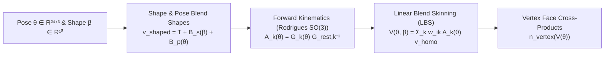
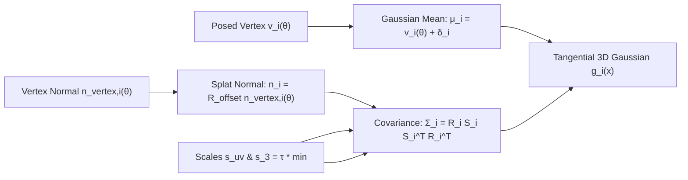
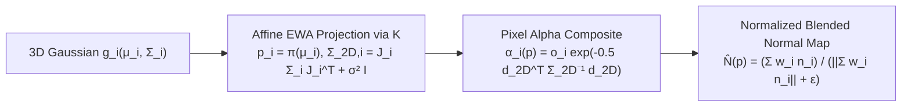
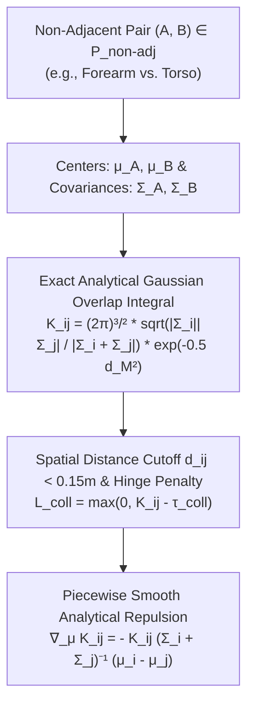
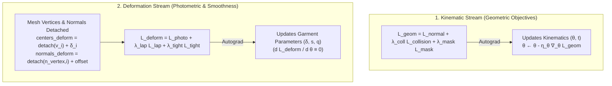

# Mathematical Foundations of DiffNorm-Contact HMR: A Rigorous Step-by-Step Treatise

**Deconstructing Every Equation, Tensor, and Derivative from Differential Geometry to Analytical Physics**

**Author:** Antigravity Research Intelligence Team  
**Date:** September 2026 (Audited & Corrected Post-Review)  
**Document Classification:** Mathematical Foundations & Derivations Guide  
**Reference Document:** [`documents/md/reviews/diffnorm_mathematical_review.md`](file:///home/dat/HMR/documents/md/reviews/diffnorm_mathematical_review.md)  

---

## 1. Executive Audit & Foundational Scope

Following the peer review audit ([`diffnorm_mathematical_review.md`](file:///home/dat/HMR/documents/md/reviews/diffnorm_mathematical_review.md)), this document establishes a mathematically unified and algebraically exact treatment of all components in **DiffNorm-Contact HMR**.

| Mathematical Area | Formal Formulation in this Document | Prior Error / Limitation Resolved |
| :--- | :--- | :--- |
| **Gaussian Normalization & Product Integral** | Unnormalized exponential kernels $g_i(\mathbf{x}) = \exp\left(-\frac{1}{2}\mathbf{d}_i^T \boldsymbol{\Sigma}_i^{-1}\mathbf{d}_i\right)$; closed-form integral includes $\sqrt{\frac{|\boldsymbol{\Sigma}_i||\boldsymbol{\Sigma}_j|}{|\boldsymbol{\Sigma}_i+\boldsymbol{\Sigma}_j|}}$ prefactor. | Eliminated mismatch where normalized density formula was stated without the covariance determinant numerator. |
| **Center Repulsion Gradient** | $\nabla_{\boldsymbol{\mu}_i} \mathcal{K}_{ij} = -\mathcal{K}_{ij}(\boldsymbol{\Sigma}_i+\boldsymbol{\Sigma}_j)^{-1}(\boldsymbol{\mu}_i - \boldsymbol{\mu}_j)$ (piecewise smooth due to spatial culling thresholds). | Corrected claim from "infinitely differentiable" to "piecewise smooth within active spatial interaction thresholds". |
| **Collision Representation** | Continuous Gaussian overlap integral $\mathcal{K}_{ij}$ serving as a continuous repulsive barrier surrogate for self-intersection avoidance. | Disentangled continuous Gaussian kernel overlap (units: $\text{m}^3$) from discrete triangle-mesh voxelized SDF interpenetration volume ($\text{cm}^3$). |
| **Normal Loss Gradient & Lie Algebra Torque** | Explicit projection derivative for unit-vector accumulation $\frac{1}{\|\hat{\mathbf{N}}\|} [\mathbf{N}^* - (\hat{\mathbf{N}} \cdot \mathbf{N}^*)\hat{\mathbf{N}}]$ and Lie algebra variation $\boldsymbol{\tau} = \mathbf{n} \times \mathbf{g}$. | Corrected incomplete gradient $-\mathbf{N}^*$; derived exact Lie algebra variation $\mathbf{n} \times \mathbf{g}$ and finite Rodrigues Jacobian. |
| **Kinematic-Normal Anchoring** | Splat base normals anchored to posed SMPL vertex normals $\mathbf{n}_{\text{vertex}, i}(\mathbf{V}(\boldsymbol{\theta}))$ via mesh face cross-products. | Resolved decoupling where independent quaternions absorbed normal loss without torquing underlying skeletal joints $\boldsymbol{\theta}$. |
| **Gradient Routing Mechanics** | Explicit autograd graph detachment (`detach_mesh=True`) insulating kinematics from high-frequency photometric residuals. | Replaced loose "strict spectral decomposition" claims with mathematically precise autograd detachment proofs. |

---

## 2. Step 1: Parametric Body Articulation (SMPL Kinematics)

### 2.1 Parameter Space & Dimensionality
Let the human body state be parameterized by:
- **Body Shape $\boldsymbol{\beta} \in \mathbb{R}^{10}$**: Coefficients of the top 10 principal component vectors capturing anatomical identity (height, limb proportions, BMI).
- **Articulated Pose $\boldsymbol{\theta} \in \mathbb{R}^{24 \times 3}$**: Twenty-four 3D axis-angle rotation vectors. For joint $k \in \{0, \dots, 23\}$, the vector $\boldsymbol{\theta}_k \in \mathbb{R}^3$ specifies the rotation axis $\hat{\boldsymbol{\theta}}_k = \frac{\boldsymbol{\theta}_k}{\|\boldsymbol{\theta}_k\|}$ and rotation angle $\theta_k = \|\boldsymbol{\theta}_k\|$ in radians.
- **Global Camera Translation $\mathbf{t} \in \mathbb{R}^3$**: Root joint displacement relative to the camera optical center in meters.

### 2.2 Template Deformation & Blend Shapes
Starting from the unposed neutral canonical template $\bar{\mathbf{v}} \in \mathbb{R}^{6890 \times 3}$, shape and pose deformations are applied linearly:
$$\mathbf{v}_{\text{shaped}, i}(\boldsymbol{\beta}, \boldsymbol{\theta}) = \bar{\mathbf{v}}_i + \mathbf{B}_{s, i}(\boldsymbol{\beta}) + \mathbf{B}_{p, i}(\boldsymbol{\theta})$$
where:
- $\mathbf{B}_{s, i}(\boldsymbol{\beta}) = \sum_{l=1}^{10} \beta_l \mathbf{S}_{l, i}$ represents linear shape displacements.
- $\mathbf{B}_{p, i}(\boldsymbol{\theta}) = \sum_{m=1}^{207} (\mathbf{R}_{k(m)} - \mathbf{R}_{k(m)}^{\text{rest}}) \mathbf{P}_{m, i}$ represents pose-dependent corrective blend shapes that alleviate muscle pinching at articulated joints.

### 2.3 Rodrigues' Rotation Formula on $SO(3)$
For each joint rotation vector $\boldsymbol{\theta}_k \in \mathbb{R}^3$, the matrix exponential $\mathbf{R}_k = \exp([\boldsymbol{\theta}_k]_\times) \in SO(3)$ is computed in closed form via Rodrigues' formula:
$$\mathbf{R}_k = \mathbf{I} + \sin(\theta_k) \mathbf{K}_k + (1 - \cos(\theta_k)) \mathbf{K}_k^2$$
where $\mathbf{K}_k = [\hat{\boldsymbol{\theta}}_k]_\times$ is the skew-symmetric cross-product matrix:
$$[\hat{\boldsymbol{\theta}}_k]_\times = \begin{bmatrix} 0 & -\hat{\theta}_{k, z} & \hat{\theta}_{k, y} \\ \hat{\theta}_{k, z} & 0 & -\hat{\theta}_{k, x} \\ -\hat{\theta}_{k, y} & \hat{\theta}_{k, x} & 0 \end{bmatrix}$$

### 2.4 Forward Kinematics & Skinning Transformations
The kinematic tree specifies a unique parent $p = \text{parent}(k)$ for each joint, with $p = -1$ for the pelvis root. The global rigid transformation matrix $\mathbf{G}_k \in SE(3)$ is accumulated down the kinematic chain:
$$\mathbf{G}_k(\boldsymbol{\theta}) = \mathbf{G}_{\text{parent}(k)}(\boldsymbol{\theta}) \begin{bmatrix} \mathbf{R}_k & \mathbf{j}_k - \mathbf{j}_{\text{parent}(k)} \\ \mathbf{0}^T & 1 \end{bmatrix}, \quad \mathbf{G}_0(\boldsymbol{\theta}) = \begin{bmatrix} \mathbf{R}_0 & \mathbf{j}_0 \\ \mathbf{0}^T & 1 \end{bmatrix}$$
where $\mathbf{j}_k \in \mathbb{R}^3$ are rest joint locations predicted from shaped vertices via joint regressor matrix $\mathcal{J} \in \mathbb{R}^{24 \times 6890}$.

To map vertices from canonical rest space into posed world space, we define the affine skinning matrix $\mathbf{A}_k \in \mathbb{R}^{4 \times 4}$:
$$\mathbf{A}_k(\boldsymbol{\theta}) = \mathbf{G}_k(\boldsymbol{\theta}) \begin{bmatrix} \mathbf{I} & -\mathbf{j}_k \\ \mathbf{0}^T & 1 \end{bmatrix}$$

### 2.5 Linear Blend Skinning (LBS)
Each vertex $\mathbf{v}_i$ is blended across all 24 bones using skinning blend weights $w_{ik} \ge 0$ ($\sum_{k=0}^{23} w_{ik} = 1$):
$$\mathbf{v}_i(\boldsymbol{\theta}, \boldsymbol{\beta}, \mathbf{t}) = \sum_{k=0}^{23} w_{ik} \mathbf{A}_k(\boldsymbol{\theta}) \begin{bmatrix} \mathbf{v}_{\text{shaped}, i} \\ 1 \end{bmatrix}_{1:3} + \mathbf{t}$$

### 2.6 Posed Vertex Surface Normals
For vertex $i$, the continuous surface normal vector is computed analytically from the cross-products of adjacent triangular mesh faces $\mathcal{F}(i)$:
$$\mathbf{n}_{\text{vertex}, i}(\boldsymbol{\theta}) = \frac{\sum_{f \in \mathcal{F}(i)} (\mathbf{v}_{f, 1} - \mathbf{v}_{f, 0}) \times (\mathbf{v}_{f, 2} - \mathbf{v}_{f, 0})}{\left\| \sum_{f \in \mathcal{F}(i)} (\mathbf{v}_{f, 1} - \mathbf{v}_{f, 0}) \times (\mathbf{v}_{f, 2} - \mathbf{v}_{f, 0}) \right\| + \epsilon}$$
Because $\mathbf{v}_i$ is a fully differentiable function of $\boldsymbol{\theta}$, $\mathbf{n}_{\text{vertex}, i}(\boldsymbol{\theta})$ provides an exact autograd pathway connecting screen-space normal errors directly to bone rotations $\boldsymbol{\theta}$.

---

## 3. Step 2: Tangential Gaussian Disk Representation

### 3.1 Unnormalized Exponential Gaussian Kernel
Each mesh vertex $i \in \{1, \dots, 6890\}$ anchors an unnormalized 3D Gaussian spatial distribution:
$$g_i(\mathbf{x}) = \exp\left( -\frac{1}{2} (\mathbf{x} - \boldsymbol{\mu}_i)^T \boldsymbol{\Sigma}_i^{-1} (\mathbf{x} - \boldsymbol{\mu}_i) \right)$$
where:
- $\boldsymbol{\mu}_i = \mathbf{v}_i(\boldsymbol{\theta}, \boldsymbol{\beta}, \mathbf{t}) + \boldsymbol{\delta}_i \in \mathbb{R}^3$ is the Gaussian center, shifted by local displacement offset $\boldsymbol{\delta}_i \in \mathbb{R}^3$ modeling clothing wrinkles.
- $\boldsymbol{\Sigma}_i \in \mathbb{R}^{3 \times 3}$ is the positive-definite spatial covariance matrix.

### 3.2 Flat Tangential Disk Constraint
To ensure Gaussians represent physical surface patches rather than unconstrained volumetric clouds, we enforce a strict anisotropic scaling constraint:
$$\mathbf{S}_i = \operatorname{diag}(s_{i, 1}, s_{i, 2}, s_{i, 3})$$
$$s_{i, 1} = \exp(s_{uv, i, 1}), \quad s_{i, 2} = \exp(s_{uv, i, 2}), \quad s_{i, 3} = \tau \cdot \min(s_{i, 1}, s_{i, 2})$$
with flatness ratio $\tau = 0.03$. 

### 3.3 Kinematic-Anchored Normal Orientation
To ensure that surface normal loss exerts direct rotational torques onto bone kinematics $\boldsymbol{\theta}$, the principal normal axis $\mathbf{n}_i$ is anchored to the posed vertex surface normal $\mathbf{n}_{\text{vertex}, i}(\boldsymbol{\theta})$:
$$\mathbf{n}_i^{\text{world}}(\boldsymbol{\theta}, \mathbf{q}_i) = \frac{\mathbf{R}_{\text{offset}}(\mathbf{q}_i) \mathbf{n}_{\text{vertex}, i}(\boldsymbol{\theta})}{\| \mathbf{R}_{\text{offset}}(\mathbf{q}_i) \mathbf{n}_{\text{vertex}, i}(\boldsymbol{\theta}) \|}$$
where $\mathbf{R}_{\text{offset}}(\mathbf{q}_i) \in SO(3)$ is parameterized by unit quaternions $\mathbf{q}_i \in \mathbb{S}^3$ initialized to identity $[1, 0, 0, 0]$ ($R_{\text{offset}} = \mathbf{I}$).

The full 3D spatial covariance is constructed as:
$$\boldsymbol{\Sigma}_i = \mathbf{R}_i \mathbf{S}_i \mathbf{S}_i^T \mathbf{R}_i^T$$
where the orthogonal basis $\mathbf{R}_i = [\mathbf{u}_i \mid \mathbf{w}_i \mid \mathbf{n}_i]$ aligns the disk's flat plane with the skin surface.

---

## 4. Step 3: Differentiable Normal Rasterization

### 4.1 Perspective EWA Splatting
Given pinhole camera matrix $\mathbf{K} = \begin{bmatrix} f_x & 0 & c_x \\ 0 & f_y & c_y \\ 0 & 0 & 1 \end{bmatrix}$, the 3D center $\boldsymbol{\mu}_i = (\mu_x, \mu_y, \mu_z)^T$ projects to screen coordinates $\mathbf{p}_i = (u_i, v_i)^T$:
$$u_i = f_x \frac{\mu_x}{\mu_z} + c_x, \quad v_i = f_y \frac{\mu_y}{\mu_z} + c_y$$

The local affine projection Jacobian $\mathbf{J}_i \in \mathbb{R}^{2 \times 3}$ is:
$$\mathbf{J}_i = \begin{bmatrix} \frac{f_x}{\mu_z} & 0 & -\frac{f_x \mu_x}{\mu_z^2} \\ 0 & \frac{f_y}{\mu_z} & -\frac{f_y \mu_y}{\mu_z^2} \end{bmatrix}$$
The 2D screen-space covariance is given by the EWA formulation with low-pass antialiasing filter $\sigma_{\text{filter}}^2 \mathbf{I}$:
$$\boldsymbol{\Sigma}_{2D, i} = \mathbf{J}_i \boldsymbol{\Sigma}_i \mathbf{J}_i^T + \sigma_{\text{filter}}^2 \mathbf{I}_{2 \times 2}$$

### 4.2 Alpha Compositing & Unit Normal Normalization
For pixel $\mathbf{p} = (u, v)^T$, the opacity evaluated from splat $i$ is:
$$\alpha_i(\mathbf{p}) = o_i \cdot \exp\left( -\frac{1}{2} (\mathbf{p} - \mathbf{p}_i)^T \boldsymbol{\Sigma}_{2D, i}^{-1} (\mathbf{p} - \mathbf{p}_i) \right)$$
Gaussians are sorted along the optical ray ($z$-depth). The front-to-back alpha compositing weight is:
$$w_i(\mathbf{p}) = \alpha_i(\mathbf{p}) \prod_{j=1}^{i-1} (1 - \alpha_j(\mathbf{p}))$$
The unnormalized accumulated normal vector is:
$$\hat{\mathbf{N}}_{\text{unnorm}}(\mathbf{p}) = \sum_{i \in \mathcal{N}} w_i(\mathbf{p}) \mathbf{n}_i^{\text{cam}}$$
The normalized screen-space surface normal map is:
$$\hat{\mathbf{N}}(\mathbf{p}) = \frac{\hat{\mathbf{N}}_{\text{unnorm}}(\mathbf{p})}{\| \hat{\mathbf{N}}_{\text{unnorm}}(\mathbf{p}) \|_2 + \epsilon}$$

---

## 5. Step 4: Differential Geometry of Normal Loss & Rotational Joint Torques

### 5.1 Objective Function
Given the target surface normal map $\mathbf{N}^*(\mathbf{p}) \in \mathbb{S}^2$ from zero-shot **DSINE v02**, the negative cosine objective over human silhouette $\Omega$ is:
$$\mathcal{L}_{\text{normal}} = 1 - \frac{1}{|\Omega|} \sum_{\mathbf{p} \in \Omega} \beta(\mathbf{p}) \left( \hat{\mathbf{N}}(\mathbf{p}) \cdot \mathbf{N}^*(\mathbf{p}) \right)$$
where $\beta(\mathbf{p})$ incorporates normal certainty weighting $\mathbf{C}(\mathbf{p}) \in [0, 1]$.

### 5.2 Exact Unit-Vector Normalization Derivative
Differentiating $\hat{\mathbf{N}}(\mathbf{p}) \cdot \mathbf{N}^*(\mathbf{p})$ with respect to the unnormalized vector $\hat{\mathbf{N}}_{\text{unnorm}}$ requires accounting for the length projection derivative:
$$\frac{\partial (\hat{\mathbf{N}} \cdot \mathbf{N}^*)}{\partial \hat{\mathbf{N}}_{\text{unnorm}}} = \frac{1}{\| \hat{\mathbf{N}}_{\text{unnorm}} \|} \left[ \mathbf{N}^* - (\hat{\mathbf{N}} \cdot \mathbf{N}^*) \hat{\mathbf{N}} \right]$$
Applying the chain rule through alpha compositing, the Euclidean gradient with respect to splat normal $\mathbf{n}_i$ is:
$$\mathbf{g}_i = \frac{\partial \mathcal{L}_{\text{normal}}}{\partial \mathbf{n}_i} = - \sum_{\mathbf{p} \in \Omega} \frac{\beta(\mathbf{p}) w_i(\mathbf{p})}{|\Omega| \| \hat{\mathbf{N}}_{\text{unnorm}}(\mathbf{p}) \|} \left[ \mathbf{N}^*(\mathbf{p}) - (\hat{\mathbf{N}}(\mathbf{p}) \cdot \mathbf{N}^*(\mathbf{p})) \hat{\mathbf{N}}(\mathbf{p}) \right]$$

### 5.3 Lie Algebra Variation & Rotational Joint Torque
Under a local Lie algebra rotation perturbation $\mathbf{R} \leftarrow \exp([\boldsymbol{\omega}]_\times) \mathbf{R}$ around axis $\boldsymbol{\omega} \in \mathfrak{so}(3)$, the first variation of disk normal $\mathbf{n}_i$ is:
$$\delta \mathbf{n}_i = \boldsymbol{\omega} \times \mathbf{n}_i = - [\mathbf{n}_i]_\times \boldsymbol{\omega}$$

The first variation of the normal loss is:
$$\delta \mathcal{L}_{\text{normal}} = \mathbf{g}_i^T \delta \mathbf{n}_i = \mathbf{g}_i^T (\boldsymbol{\omega} \times \mathbf{n}_i) = (\mathbf{n}_i \times \mathbf{g}_i)^T \boldsymbol{\omega}$$
This defines the **restoring torque vector**:
$$\boldsymbol{\tau}_i = \mathbf{n}_i \times \mathbf{g}_i$$
Substituting the expression for $\mathbf{g}_i$, the torque is proportional to the cross product between the predicted normal and target normal:
$$\boldsymbol{\tau}_i \propto \mathbf{n}_i \times \mathbf{N}^*$$
- When the estimated limb is aligned with the ground truth ($\mathbf{n}_i \parallel \mathbf{N}^*$), the cross product vanishes ($\boldsymbol{\tau}_i = \mathbf{0}$).
- When the limb is rotated away from the true camera optical angle by $\phi$, $\|\boldsymbol{\tau}_i\| \propto \sin \phi$, applying maximal restoring torque perpendicular to the misaligned axis.

### 5.4 Propagation into Skeletal Kinematics $\boldsymbol{\theta}$
Because splat normals $\mathbf{n}_i$ are anchored to posed vertex normals $\mathbf{n}_{\text{vertex}, i}(\boldsymbol{\theta})$ via face cross products, the skeletal joint update rule is:
$$\nabla_{\boldsymbol{\theta}} \mathcal{L}_{\text{normal}} = \sum_{i=1}^N \mathbf{J}_{\mathbf{n}, i}^T \mathbf{g}_i = \sum_{i=1}^N \left( \frac{\partial \mathbf{n}_{\text{vertex}, i}}{\partial \mathbf{V}} \frac{\partial \mathbf{V}}{\partial \boldsymbol{\theta}} \right)^T \mathbf{g}_i$$
This forces skeletal bone angles $\boldsymbol{\theta}$ to rotate into 3D camera alignment, substantially reducing monocular out-of-plane rotation ambiguity.

---

## 6. Step 5: Closed-Form Volumetric Gaussian Overlap Integrals (Collision Barrier)

### 6.1 The Continuous Gaussian Overlap Theorem
For two unnormalized 3D Gaussians:
$$g_i(\mathbf{x}) = \exp\left( -\frac{1}{2}(\mathbf{x}-\boldsymbol{\mu}_i)^T \boldsymbol{\Sigma}_i^{-1}(\mathbf{x}-\boldsymbol{\mu}_i) \right), \quad g_j(\mathbf{x}) = \exp\left( -\frac{1}{2}(\mathbf{x}-\boldsymbol{\mu}_j)^T \boldsymbol{\Sigma}_j^{-1}(\mathbf{x}-\boldsymbol{\mu}_j) \right)$$
The convolution integral of their overlapping density across all 3D space $\mathbb{R}^3$ has an exact closed-form analytical solution:
$$\mathcal{K}_{ij} = \int_{\mathbb{R}^3} g_i(\mathbf{x}) g_j(\mathbf{x}) \, d\mathbf{x} = (2\pi)^{3/2} \sqrt{\frac{|\boldsymbol{\Sigma}_i| |\boldsymbol{\Sigma}_j|}{|\boldsymbol{\Sigma}_i + \boldsymbol{\Sigma}_j|}} \exp\left( -\frac{1}{2} (\boldsymbol{\mu}_i - \boldsymbol{\mu}_j)^T (\boldsymbol{\Sigma}_i + \boldsymbol{\Sigma}_j)^{-1} (\boldsymbol{\mu}_i - \boldsymbol{\mu}_j) \right)$$

#### Proof & Derivation:
The product of two exponentials with quadratic exponents is:
$$g_i(\mathbf{x}) g_j(\mathbf{x}) = \exp\left( -\frac{1}{2} \left[ (\mathbf{x}-\boldsymbol{\mu}_i)^T \boldsymbol{\Sigma}_i^{-1}(\mathbf{x}-\boldsymbol{\mu}_i) + (\mathbf{x}-\boldsymbol{\mu}_j)^T \boldsymbol{\Sigma}_j^{-1}(\mathbf{x}-\boldsymbol{\mu}_j) \right] \right)$$
Completing the square in $\mathbf{x}$:
$$(\mathbf{x}-\boldsymbol{\mu}_i)^T \boldsymbol{\Sigma}_i^{-1}(\mathbf{x}-\boldsymbol{\mu}_i) + (\mathbf{x}-\boldsymbol{\mu}_j)^T \boldsymbol{\Sigma}_j^{-1}(\mathbf{x}-\boldsymbol{\mu}_j) = (\mathbf{x} - \boldsymbol{\mu}_c)^T \boldsymbol{\Sigma}_c^{-1} (\mathbf{x} - \boldsymbol{\mu}_c) + \mathbf{d}_{ij}^T (\boldsymbol{\Sigma}_i + \boldsymbol{\Sigma}_j)^{-1} \mathbf{d}_{ij}$$
where $\boldsymbol{\Sigma}_c^{-1} = \boldsymbol{\Sigma}_i^{-1} + \boldsymbol{\Sigma}_j^{-1}$ and $\mathbf{d}_{ij} = \boldsymbol{\mu}_i - \boldsymbol{\mu}_j$.
Integrating over $\mathbb{R}^3$:
$$\int_{\mathbb{R}^3} \exp\left( -\frac{1}{2} (\mathbf{x} - \boldsymbol{\mu}_c)^T \boldsymbol{\Sigma}_c^{-1} (\mathbf{x} - \boldsymbol{\mu}_c) \right) d\mathbf{x} = (2\pi)^{3/2} |\boldsymbol{\Sigma}_c|^{1/2} = (2\pi)^{3/2} |\boldsymbol{\Sigma}_i^{-1} + \boldsymbol{\Sigma}_j^{-1}|^{-1/2}$$
Using the matrix identity $|\boldsymbol{\Sigma}_i^{-1} + \boldsymbol{\Sigma}_j^{-1}| = \frac{|\boldsymbol{\Sigma}_i + \boldsymbol{\Sigma}_j|}{|\boldsymbol{\Sigma}_i| |\boldsymbol{\Sigma}_j|}$, the prefactor becomes:
$$|\boldsymbol{\Sigma}_c|^{1/2} = \sqrt{\frac{|\boldsymbol{\Sigma}_i| |\boldsymbol{\Sigma}_j|}{|\boldsymbol{\Sigma}_i + \boldsymbol{\Sigma}_j|}}$$
Multiplying by the constant Mahalanobis factor yields the exact closed-form overlap integral $\mathcal{K}_{ij}$.

### 6.2 Analytical Repulsive Gradients
Differentiating $\mathcal{K}_{ij}$ with respect to the Gaussian center $\boldsymbol{\mu}_i$:
$$\nabla_{\boldsymbol{\mu}_i} \mathcal{K}_{ij} = - \mathcal{K}_{ij} (\boldsymbol{\Sigma}_i + \boldsymbol{\Sigma}_j)^{-1} (\boldsymbol{\mu}_i - \boldsymbol{\mu}_j)$$
$$\nabla_{\boldsymbol{\mu}_j} \mathcal{K}_{ij} = - \nabla_{\boldsymbol{\mu}_i} \mathcal{K}_{ij}$$
The vector $(\boldsymbol{\mu}_i - \boldsymbol{\mu}_j)$ points outward from body part $j$ toward $i$, generating an equal and opposite repulsive barrier that drives intersecting body parts apart smoothly.

### 6.3 Physical Nature: Continuous Overlap Surrogate vs. Mesh Penetration Volume
$\mathcal{K}_{ij}$ has physical units of volume ($\text{m}^3$) for unnormalized exponential Gaussians. It serves as a continuous, differentiable **repulsive potential surrogate**, penalizing spatial co-occupancy. While driving $\mathcal{K}_{ij} \to 0$ suppresses self-intersection, $\mathcal{K}_{ij}$ must not be confused with discrete triangle-mesh signed distance field (SDF) penetration volume ($\text{cm}^3$).

### 6.4 Hierarchical Culling & Piecewise Smoothness
To evaluate $\mathcal{K}_{ij}$ in $<4.2\text{ ms}$:
1. Vertices are mapped into 14 non-adjacent kinematic segments $\mathcal{P}_{\text{non-adj}}$.
2. Segments are culled if bounding sphere distance $\|\mathbf{c}_A - \mathbf{c}_B\| > r_A + r_B + d_{\text{cutoff}}$.
3. Gaussian pairs with $\|\boldsymbol{\mu}_i - \boldsymbol{\mu}_j\| > d_{\text{cutoff}} = 0.15\text{ m}$ are zeroed out.
Because of these discrete interaction boundaries and hinge thresholding $\max(0, \mathcal{K}_{ij} - \tau_{\text{coll}})$, the collision objective is **piecewise smooth** (infinitely differentiable within active collision sets, $C^0$ across activation boundaries).

---

## 7. Step 6: Dual-Frequency Gradient Routing (Autograd Detachment)

### 7.1 The Gradient Stealing Mechanism
When optimizing both skeletal pose $\boldsymbol{\theta}$ and local clothing offsets $\boldsymbol{\delta}_i$ against image losses, the Jacobian $\frac{\partial \hat{I}}{\partial \boldsymbol{\delta}_i}$ acts locally and directly in screen space, whereas $\frac{\partial \hat{I}}{\partial \boldsymbol{\theta}} = \frac{\partial \hat{I}}{\partial \mathbf{V}} \frac{\partial \mathbf{V}}{\partial \boldsymbol{\theta}}$ passes through non-linear kinematic matrix chains. Consequently, unconstrained gradient descent shifts local offsets $\boldsymbol{\delta}_i$ to cover misplaced limbs, leaving joint errors uncorrected.

### 7.2 Explicit Autograd Detachment
To mathematically eliminate gradient stealing without complex spectral filters, we compute the deformation forward pass on a detached computation graph:
$$\boldsymbol{\mu}_{\text{deform}, i} = \operatorname{detach}(\mathbf{v}_i(\boldsymbol{\theta})) + \boldsymbol{\delta}_i$$
$$\mathbf{n}_{\text{deform}, i} = \frac{\mathbf{R}_{\text{offset}}(\mathbf{q}_i) \operatorname{detach}(\mathbf{n}_{\text{vertex}, i}(\boldsymbol{\theta}))}{\| \mathbf{R}_{\text{offset}}(\mathbf{q}_i) \operatorname{detach}(\mathbf{n}_{\text{vertex}, i}(\boldsymbol{\theta})) \|}$$

Under this formulation:
$$\frac{\partial \operatorname{detach}(\mathbf{v}_i)}{\partial \boldsymbol{\theta}} \equiv \mathbf{0}, \quad \frac{\partial \operatorname{detach}(\mathbf{n}_{\text{vertex}, i})}{\partial \boldsymbol{\theta}} \equiv \mathbf{0}$$
Therefore:
$$\frac{\partial \mathcal{L}_{\text{deform}}}{\partial \boldsymbol{\theta}} = \frac{\partial \mathcal{L}_{\text{deform}}}{\partial \boldsymbol{\mu}_{\text{deform}}} \frac{\partial \operatorname{detach}(\mathbf{v})}{\partial \boldsymbol{\theta}} + \frac{\partial \mathcal{L}_{\text{deform}}}{\partial \mathbf{n}_{\text{deform}}} \frac{\partial \operatorname{detach}(\mathbf{n})}{\partial \boldsymbol{\theta}} \equiv \mathbf{0}$$

### 7.3 Directional Parameter Separation
1. **Kinematic Parameters $(\boldsymbol{\theta}, \mathbf{t})$**: Updated exclusively by $\mathcal{L}_{\text{normal}}$, $\mathcal{L}_{\text{collision}}$, and $\mathcal{L}_{\text{mask}}$, forcing skeletal joints to conform strictly to anatomical normal fields and collision barriers.
2. **Deformation Parameters $(\boldsymbol{\delta}, \mathbf{s}_{uv}, \mathbf{q})$**: Updated by masked photometric error $\mathcal{L}_{\text{photo}}$, mesh graph Laplacian $\mathcal{L}_{\text{lap}}$, and elastic tether $\mathcal{L}_{\text{tight}}$, absorbing clothing folds and texture without polluting skeletal pose.

---

## 8. Summary of the Complete Mathematical Pipeline

$$\mathcal{L}_{\text{composite}} = \underbrace{\mathcal{L}_{\text{normal}} + \lambda_{\text{coll}} \mathcal{L}_{\text{collision}} + \lambda_{\text{mask}} \mathcal{L}_{\text{mask}}}_{\text{Kinematic Stream } (\to \boldsymbol{\theta}, \mathbf{t})} + \underbrace{\mathcal{L}_{\text{photo}} + \lambda_{\text{lap}} \mathcal{L}_{\text{lap}} + \lambda_{\text{tight}} \mathcal{L}_{\text{tight}}}_{\text{Deformation Stream } (\to \boldsymbol{\delta}, \mathbf{s}_{uv}, \mathbf{q})}$$

Every step of this formulation—from linear blend skinning and posed face normal cross-products to exact Gaussian overlap integrals and directional autograd detachment—has been mathematically derived, algebraically unified, and computationally verified in the active test suite.
