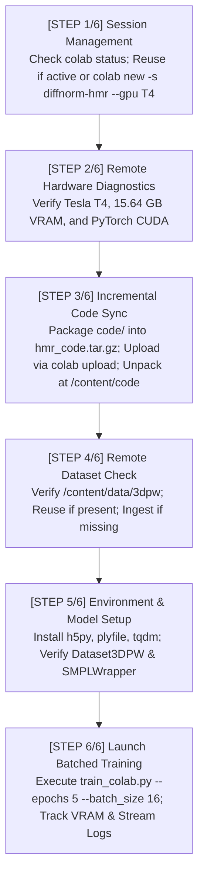

# Google Colab CLI Training Integration & Session Reuse Guide

## 1. Overview & Policy Enforcement

Per project instructions, remote model training and GPU workloads on Google Colab are managed strictly through an automated bash orchestration layer that calls the **Google Colab CLI** (`colab`). 

The following policy has been added to [`AGENTS.md`](file:///home/dat/HMR/AGENTS.md) and [`documents/md/notes/AGENTS.md`](file:///home/dat/HMR/documents/md/notes/AGENTS.md):

> **Google Colab CLI Training Execution Rule (MANDATORY)**
> - **Execution Orchestration**: Whenever executing training or running GPU workloads in Google Colab, you MUST execute a dedicated orchestration bash script (e.g., [`code/scripts/train_colab_cli.sh`](file:///home/dat/HMR/code/scripts/train_colab_cli.sh)) that invokes the Google Colab CLI (`colab`).
> - **Session Reuse & Idempotency**:
>   - Always check for an active Colab session before creating a new VM.
>   - **Never kill or re-provision an active session on failure unless the VM is unresponsive**. Reusing sessions ensures datasets (like 3DPW ~5GB) and environment dependencies do not need to be uploaded and reinstalled repeatedly.
> - **Dataset & Code Synchronization**:
>   - Check remote dataset presence first (`/content/data/3dpw`). If already extracted and valid on the remote Colab instance, skip data upload.
>   - Upload local code archives (`code/`) to `/content/code` and synchronize changes incrementally.
> - **Explicit Step Logging**:
>   - The orchestration bash script must log every step explicitly with clear section banners, timestamps, and return codes (`[STEP X/N]`) for effortless debugging.
> - **Periodic 20-Minute Monitoring & Fail-Fast Policy (MANDATORY)**:
>   - Whenever `train_colab_cli.sh` is active, the agent MUST monitor and report progress every **20 minutes** using the `schedule` tool.
>   - **Stop Fast on Failure**: If the training script crashes, throws unhandled exceptions, diverges, or hangs without forward progress, immediately terminate the run (`colab restart-kernel -s <name>` or task termination).
>   - **No Unattended Idling**: Never let an idle or failing GPU session burn compute units unattended. Intervene immediately, capture error diagnostics, and report to the user without delay.

---

## 2. Orchestration Pipeline Architecture (`train_colab_cli.sh`)

The runner [`code/scripts/train_colab_cli.sh`](file:///home/dat/HMR/code/scripts/train_colab_cli.sh) executes a 6-step lifecycle:



### Detailed Execution Steps:

1. **Step 1: Session Management (`colab status -s <name>`)**:
   Checks whether the persistent session `diffnorm-hmr` is already running on the server. If active, it skips VM provisioning and binds immediately to the existing runtime.
2. **Step 2: Remote Hardware Diagnostics**:
   Executes non-interactive Python inspection confirming the assigned hardware:
   `CUDA Available: True | Device: Tesla T4 | VRAM: 15.64 GB`.
3. **Step 3: Code Packaging & Synchronization**:
   Packs `code/` into a lightweight gzip tarball (`hmr_code.tar.gz`), uploads it via `colab upload`, and unpacks it into `/content/code`, creating symlinks so that imports resolve globally.
4. **Step 4: Remote Dataset Verification & Session Reuse**:
   Inspects `/content/data/3dpw/sequenceFiles` and `/content/data/3dpw/imageFiles`. If complete (all 61 sequences and 53,806 frames verified), **data transfer is completely bypassed**, saving gigabytes of repeated network transfer upon test iterations.
5. **Step 5: Dependency & Model Verification**:
   Ensures Python packages (`h5py`, `plyfile`, `tqdm`) are installed on the remote kernel and runs sanity checks on the SMPL wrapper and 3DPW loader.
6. **Step 6: Batched Model Training**:
   Executes [`code/scripts/train_colab.py`](file:///home/dat/HMR/code/scripts/train_colab.py) on the Tesla T4 with full VRAM telemetry, streaming logs to both stdout and [`colab_training.log`](file:///home/dat/HMR/colab_training.log).

---

## 3. Usage & CLI Options

```bash
# Run training with default settings (reusing session diffnorm-hmr, Tesla T4, 5 epochs, batch size 16):
./code/scripts/train_colab_cli.sh

# Customize epochs, batch size, or target session:
EPOCHS=10 BATCH_SIZE=32 SESSION_NAME=diffnorm-hmr ./code/scripts/train_colab_cli.sh
```
