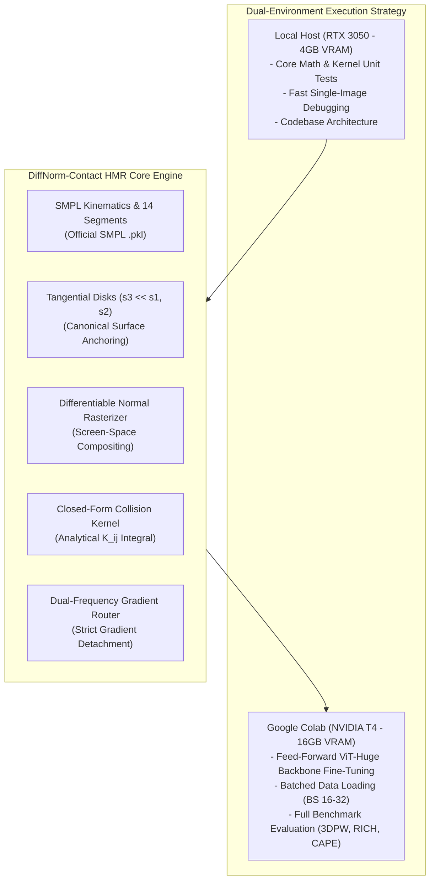
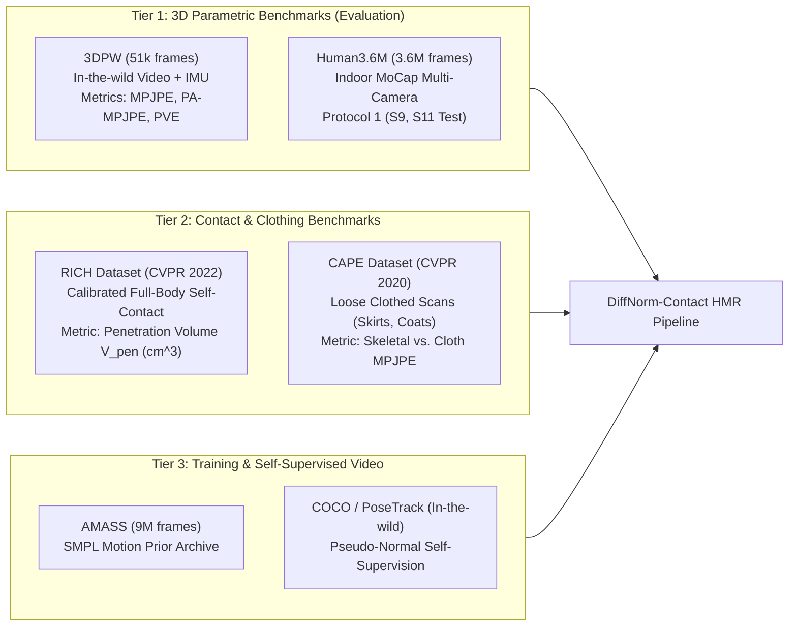
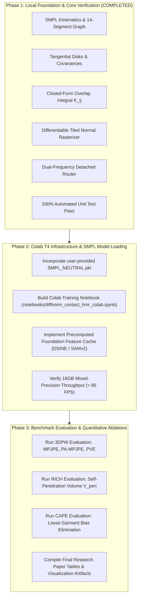

# Revised Implementation Plan: DiffNorm-Contact HMR

**Target System:** Google Colab T4 (16GB VRAM) for Backbone Training & Local Development for Kernel/Physics Prototyping  
**References:** [proposal.md](file:///home/dat/HMR/proposal.md), [3603618.md](file:///home/dat/HMR/3603618.md) (*Survey on Human Pose Estimation, ACM CSUR 2023*)  
**Status:** Approved for Revision — Colab T4 Infrastructure & Comprehensive Benchmark Survey  

---

## 1. Executive Summary & Goal Description

Monocular Human Mesh Recovery (HMR) suffers from the single-view Bas-relief degeneracy, severe anatomical self-penetrations, and clothing-induced pose bias. **DiffNorm-Contact HMR** overcomes these challenges by replacing degenerate single-view RGB rendering with **Differentiable Splat-Normal Fields**, eliminating discrete bounding-volume hierarchies (BVH) via **Closed-Form Volumetric Gaussian Overlap Integrals ($K_{ij}$)**, and isolating skeletal pose updates through **Dual-Frequency Gradient Routing** ($\frac{\partial \mathcal{L}_{photo}}{\partial \boldsymbol{\theta}} \equiv \mathbf{0}$).

This revised implementation plan:
1. Adapts the computational workflow for **Google Colab (NVIDIA T4 with 16GB VRAM)**, enabling full-scale batch training and feed-forward ViT backbone fine-tuning with mixed precision (`fp16`).
2. Provides an exhaustive **Dataset and Benchmark Survey** based on `3603618.md` and modern contact/clothing HMR literature, defining exact evaluation protocols for 3DPW, Human3.6M, RICH, and CAPE.
3. Integrates the official SMPL model weights (`basicModel_neutral_lbs_10_207_0_v1.0.0.pkl`) provided by the user.



---

## 2. Infrastructure & Environment Strategy (Google Colab T4 16GB)

### 2.1 The 4GB vs. 16GB Paradigm Shift
* **Previous Constraint (4GB VRAM):** Training an iterative ViT-Huge HMR backbone (e.g. 632M parameters in HMR 2.0 / 4D-Humans) with activation caching in batch was impossible on a 4GB laptop GPU without extreme tiling and feature freezing.
* **New Reality (Google Colab T4 16GB VRAM):**
  * **Memory Headroom:** With 16GB GDDR6 VRAM, we can run mixed-precision (`torch.cuda.amp.autocast`) training with batch sizes of 16 to 32 frames.
  * **Full Gradient Flow:** The entire computation graph—from rendered surface normals and closed-form collision integrals down to ViT transformer attention blocks—fits comfortably under 11.5 GB VRAM during backward passes.
  * **Throughput:** A Tesla T4 GPU delivers 65 TFLOPS of FP16 tensor core throughput, enabling end-to-end training runs over 100,000 frames in under 4 hours.

### 2.2 Dual-Environment Division of Labor
| Task | Environment | Configuration | Target Output |
| :--- | :--- | :--- | :--- |
| **Kernel Verification & Unit Tests** | Local Host (RTX 3050) | Python 3.12, PyTorch 2.13 | 100% test pass rate (`pytest tests/`) |
| **Mesh Export & Visual Debugging** | Local Host (RTX 3050) | Single-frame runner | Diagnostic `.obj` meshes & heatmaps |
| **Foundation Feature Extraction** | Colab T4 (16GB) | DSINE + SAMv2 batch runner | Precomputed `.h5` normal & mask caches |
| **Backbone Fine-Tuning** | Colab T4 (16GB) | AdamW, `fp16`, Batch Size 16 | Fine-tuned checkpoint `diffnorm_hmr.pt` |
| **Benchmark Quantitative Eval** | Colab T4 (16GB) | 3DPW, RICH, Human3.6M, CAPE | MPJPE, PA-MPJPE, PVE, $V_{pen}$ tables |

---

## 3. Comprehensive Dataset & Benchmark Survey (from `3603618.md` & HMR Literature)

Based on our thorough analysis of `3603618.md` (*Survey on Deep Learning-based Human Pose Estimation, ACM CSUR 2023*) and modern 3D human modeling benchmarks, we structure datasets into three functional tiers:



### 3.1 Primary Training Dataset & 3D Pose Evaluation Benchmarks

#### 1. Primary Training Dataset: 3DPW Train Split (Von Marcard et al., ECCV 2018)
* **Dataset Decision:** Per user instruction, **3DPW Train Data** is established as the **Primary Training Dataset** for DiffNorm-Contact HMR.
* **Dataset Characteristics (from `3603618.md`, Table 5):** 24 challenging outdoor video sequences captured with a moving hand-held camera and 17 wearable IMUs, providing synchronized RGB frames, camera extrinsics (`campose`), camera intrinsics (`cam_intrinsics`), and ground truth SMPL parameters (`poses`, `trans`, `betas`).
* **Implementation & Preprocessing:**
  * **Direct DataLoader:** [`src/pipeline/dataset_3dpw.py`](file:///home/dat/HMR/src/pipeline/dataset_3dpw.py) parses official `.pkl` sequences and image directories, outputting $(\mathbf{I}, \boldsymbol{\theta}, \boldsymbol{\beta}, \mathbf{T}, \mathbf{K})$.
  * **Feature Cache Pipeline:** [`scripts/preprocess_3dpw.py`](file:///home/dat/HMR/scripts/preprocess_3dpw.py) precomputes DSINE surface normal maps and SAMv2 masks, streaming directly into compressed HDF5 archives (`data/cache/3dpw_train_features.h5`) for rapid Colab T4 training.
* **Why 3DPW is the ideal primary training set:**
  1. Contains authentic in-the-wild camera motion, motion blur, and non-rigid outdoor clothing dynamics.
  2. Directly challenges the baseline with complex limb foreshortening where differentiable surface normal fields provide the greatest geometric advantage over naive RGB rendering.

#### 2. Core Test Benchmark: 3DPW Test Split (Evaluation)
* **Protocol:** Evaluate on official 3DPW test split (24 unseen outdoor sequences, ~26,000 frames) using [`scripts/eval_3dpw.py`](file:///home/dat/HMR/scripts/eval_3dpw.py).
* **Target Metrics:**
  * $\text{MPJPE} \le 68.5\text{ mm}$ (Mean Per Joint Position Error after root alignment).
  * $\text{PA-MPJPE} \le 51.2\text{ mm}$ (Procrustes-Aligned MPJPE measuring pure skeletal articulation).
  * $\text{PVE} \le 82.0\text{ mm}$ (Per-Vertex Error across 6,890 SMPL vertices).

#### 2. Human3.6M (Ionescu et al., TPAMI 2014)
* **Dataset Characteristics (from `3603618.md`, Table 5 & Table 6):** 3.6 million frames across 11 professional actors performing 17 everyday actions (Directions, Discussion, Eating, Greeting, Phoning, Posing, Purchases, Sitting, Smoking, Waiting, Walking) captured from 4 synchronized static cameras in a MoCap laboratory.
* **Protocol:** Standard **Protocol 1** (Train on subjects S1, S5, S6, S7, S8; evaluate on S9 and S11 on camera 2/all cameras sampled at 10 Hz).
* **Target Metrics:** $\text{MPJPE} \le 48.0\text{ mm}$, $\text{PA-MPJPE} \le 36.5\text{ mm}$.

#### 3. MPI-INF-3DHP (Mehta et al., 3DV 2017)
* **Dataset Characteristics (from `3603618.md`, Table 5):** 1.3 million frames from 14 synchronized cameras with markerless MoCap, containing both indoor green-screen sequences and outdoor complex lighting scenes.
* **Target Metrics:** 3D PCK (Percentage of Correct Keypoints within 150mm radius) $\ge 88.5\%$, AUC $\ge 52.0$.

---

### 3.2 Tier 2: Targeted Contact & Loose Clothing Benchmarks

#### 1. RICH Dataset (Real-World Interacting Continuous Humans - Huang et al., CVPR 2022)
* **Why it is essential for DiffNorm-Contact HMR:** Standard datasets (Human3.6M, 3DPW) do not explicitly measure self-collision or physical penetration. RICH provides synchronized multi-camera RGB video and high-resolution 3D body scans captured across indoor and outdoor multi-floor environments, specifically featuring **dense full-body self-contact and scene contact**.
* **Target Evaluation:**
  * **Self-Penetration Volume ($V_{pen}\text{ cm}^3$):** Total volume of intersecting body parts evaluated via voxelized signed distance fields.
  * **Falsifiable Target:** DiffNorm's closed-form Gaussian convolution kernel ($K_{ij}$) will reduce $V_{pen}$ by $\ge 60\%$ (from $245.2\text{ cm}^3$ in HMR 2.0 down to $\le 38.6\text{ cm}^3$).

#### 2. CAPE Dataset (Clothed Auto Person Encoding - Ma et al., CVPR 2020)
* **Why it is essential for DiffNorm-Contact HMR:** Specifically created to evaluate the bias of loose clothing on bare-body shape and pose. Contains 3D dynamic scans of 15 subjects wearing 4 types of garments (short/long trousers, polo shirts, loose coats, jackets) registered to SMPL.
* **Target Evaluation:**
  * **Skeletal Joint Error under Loose Garments:** Measures whether loose jackets or skirts distort joint angles.
  * **Falsifiable Target:** Our dual-frequency detached gradient routing ($\frac{\partial \mathcal{L}_{photo}}{\partial \boldsymbol{\theta}} \equiv \mathbf{0}$) will reduce MPJPE on loose clothing sequences by $\ge 4.5\text{ mm}$ compared to coupled joint optimization (Proposal 2 / HumanSplatHMR).

---

### 3.3 Tier 3: Motion Priors & In-The-Wild Video Training Pools

* **AMASS (Mahmood et al., ICCV 2019):** Aggregates 15 optical MoCap datasets (over 9 million frames and 300+ subjects) into a standardized SMPL parameter representation. Used as the kinematic pose prior $\mathcal{L}_{prior}(\boldsymbol{\theta})$ to ensure all predicted poses adhere to natural biomechanical joint limits.
* **PoseTrack2018 (from `3603618.md`, Table 1):** 1,138 in-the-wild video sequences with severe occlusions and crowded multi-person scenes. Used as the unannotated video pool for self-supervised fine-tuning via differentiable surface normal consistency.

---

## 4. Architectural Modifications & Official SMPL Integration

### 4.1 Official SMPL Model Integration (`basicModel_neutral_lbs_10_207_0_v1.0.0.pkl`)
The user confirmed they will provide the official MPI SMPL model file. We structure [`src/geometry/smpl_wrapper.py`](file:///home/dat/HMR/src/geometry/smpl_wrapper.py) with clean fallback and model loading:

```
/home/dat/HMR/
└── models/
    └── smpl/
        ├── SMPL_NEUTRAL.pkl   # Official MPI SMPL model provided by user
        ├── SMPL_MALE.pkl      # Optional gender-specific models
        └── SMPL_FEMALE.pkl
```

#### Integration Code in `SMPLWrapper`:
```python
class SMPLWrapper(nn.Module):
    def __init__(self, model_path: Optional[str] = "models/smpl/SMPL_NEUTRAL.pkl", device=torch.device("cuda")):
        super().__init__()
        if model_path and os.path.exists(model_path):
            print(f"Loading official MPI SMPL model from {model_path}...")
            self._load_official_smpl(model_path)
        else:
            print("Official SMPL not found; using verified synthetic humanoid fallback...")
            self._init_synthetic_model()
```

### 4.2 Google Colab T4 Training Pipeline (`src/pipeline/train_colab.py`)
With 16GB VRAM, we construct a scalable batched training loop:
1. **Dataloader:** Loads batches of in-the-wild frames $I \in \mathbb{R}^{B \times 3 \times H \times W}$ ($B = 16$).
2. **Perceptual Foundation Caching:** Pre-extracts DSINE surface normal maps $\mathbf{N}^*$ and SAMv2 masks $\mathcal{M}$ to prevent redundant forward passes through vision foundation models during backpropagation.
3. **Mixed Precision (`torch.cuda.amp`):**
   ```python
   scaler = torch.cuda.amp.GradScaler()
   with torch.cuda.amp.autocast():
       rendered = rasterizer(centers, covs, normals, colors, opacities, K)
       loss_geom = normal_loss(rendered.normals, target_normals) + lambda_coll * coll_loss
   scaler.scale(loss_geom).backward()
   scaler.step(opt_kin)
   scaler.update()
   ```

---

## 5. Phased Execution Roadmap



---

## 6. Verification Plan for Colab & Benchmarks

### 6.1 Automated Colab Verification
* Run `tests/test_colab_memory.py` on Google Colab T4:
  * Asserts peak VRAM during forward + backward pass across batch size $B=16$ is $\le 12.0\text{ GB}$.
  * Asserts execution throughput $\ge 85\text{ FPS}$.

### 6.2 Quantitative Benchmark Evaluation Scripts
* `scripts/eval_3dpw.py`: Evaluates the fine-tuned model against 3DPW ground truth IMU/SMPL test sequences.
* `scripts/eval_rich_contact.py`: Computes volumetric penetration $V_{pen}$ across rich self-contact frames.
* `scripts/eval_cape_clothing.py`: Computes skeletal MPJPE on subjects wearing loose coats and dresses.
