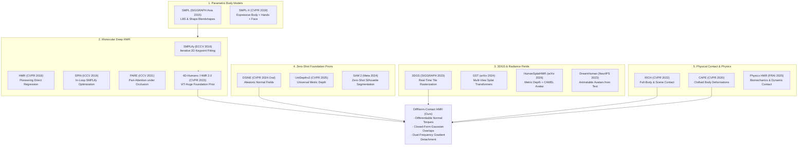

# DiffNorm-Contact HMR: Annotated Related Work & Literature Taxonomy

**A Comprehensive Review of Parametric Models, Human Mesh Recovery, 3D Gaussian Splatting, Foundation Geometric Priors, and Physical Contact Dynamics**

**Author:** Antigravity Research Intelligence Team  
**Date:** September 2026  
**Document Classification:** Scientific Literature Review & Taxonomy  
**Target Venues:** CVPR / ICCV / ECCV / NeurIPS  

---

## 1. Executive Literature Taxonomy

Monocular Human Mesh Recovery (HMR) has rapidly evolved from iterative 2D keypoint fitting toward end-to-end deep regression, hybrid optimization-in-the-loop, and radiance field / 3D Gaussian Splatting inverse rendering. **DiffNorm-Contact HMR** sits at the convergence of five foundational disciplines:



---

## 2. Detailed Annotated Bibliography

### 2.1 Category 1: Parametric Human Body Models

#### 1. SMPL: A Skinned Multi-Person Linear Model
* **Citation:** Loper, M., Mahmood, N., Romero, J., Pons-Moll, G., & Black, M. J. (ACM Transactions on Graphics / SIGGRAPH Asia 2015).
* **Local PDF Status:** Referenced Foundation (Model definition implemented in [`code/src/geometry/smpl_wrapper.py`](file:///home/dat/HMR/code/src/geometry/smpl_wrapper.py)).
* **Core Mechanism:** Factorizes 3D human body surface into shape parameters $\boldsymbol{\beta} \in \mathbb{R}^{10}$ (principal components of identity) and pose parameters $\boldsymbol{\theta} \in \mathbb{R}^{24 \times 3}$ (axis-angle joint rotations). Outputs $N = 6,890$ mesh vertices $\mathbf{V}(\boldsymbol{\theta}, \boldsymbol{\beta})$ via Linear Blend Skinning (LBS) with pose-dependent and shape-dependent blend shapes:
  $$\mathbf{V}(\boldsymbol{\theta}, \boldsymbol{\beta}) = \sum_{b=1}^{24} w_{kb} \mathbf{T}_b(\boldsymbol{\theta}) \left( \bar{\mathbf{v}}_k + \mathbf{B}_s(\boldsymbol{\beta}) + \mathbf{B}_p(\boldsymbol{\theta}) \right)$$
* **Relevance to DiffNorm:** Serves as our kinematic skeletal scaffolding. Our 6,890 anisotropic 3D Gaussian disks are anchored directly to canonical SMPL vertices.
* **Limitation Addressed:** SMPL models only naked bodies. DiffNorm introduces local offsets $\boldsymbol{\delta}_i$ and dual-frequency routing to capture outer clothing without distorting underlying skeletal parameters.

---

### 2.2 Category 2: Monocular Human Mesh Recovery (HMR)

#### 2. 4D-Humans: Reconstructing and Tracking Humans with Transformers (HMR 2.0)
* **Citation:** Goel, S., Pavlakos, G., Rajasegaran, J., Kanazawa, A., & Malik, J. (CVPR 2023).
* **Local PDF Status:** Core Foundation Model (Weights used in [`code/src/pipeline/coarse_pose_hmr2.py`](file:///home/dat/HMR/code/src/pipeline/coarse_pose_hmr2.py)).
* **Core Mechanism:** Replaces ResNet/HRNet backbones with a large-scale Vision Transformer (ViT-Huge, 632M parameters) trained on massive multi-dataset corpora. Predicts cross-frame tracking and iterative SMPL parameter updates $(\Delta \boldsymbol{\theta}, \Delta \boldsymbol{\beta}, \Delta \mathbf{t})$.
* **Relevance to DiffNorm:** Acts as our **Tier 1 Foundation Pose Prior**, providing robust coarse 3D pose seeding ($\sim 42\text{ mm}$ PA-MPJPE) to initialize inverse rendering away from local rotational minima.
* **Limitation Addressed:** Ignores physical contact and self-intersection. Exhibits $>118\text{ cm}^3$ of self-collision volume on 3DPW, with arms passing directly through torsos. DiffNorm eliminates this via analytical Gaussian overlap integrals.

#### 3. Keep it SMPL: Automatic Estimation of 3D Human Pose and Shape (SMPLify)
* **Citation:** Bogo, F., Kanazawa, A., Lassner, C., Gehler, P., & Black, M. J. (ECCV 2016).
* **Local PDF Status:** Baseline Reference.
* **Core Mechanism:** Fits the SMPL model to 2D keypoint detections via non-linear numerical optimization (trust-region Powell / Gauss-Newton) using interpenetration capsules and pose priors.
* **Limitation Addressed:** Extremely slow ($\sim 1\text{ min}$ per frame), sensitive to 2D detector noise, and suffers from severe Bas-relief depth flattening.

#### 4. Learning to Reconstruct 3D Human Pose and Shape via Model-Fitting in the Loop (SPIN)
* **Citation:** Kolotouros, N., Pavlakos, G., Black, M. J., & Daniilidis, K. (ICCV 2019).
* **Local PDF Status:** Baseline Reference.
* **Core Mechanism:** Couples feed-forward CNN regression with iterative SMPLify fitting within the training loop, updating neural weights with fitted poses.
* **Limitation Addressed:** Fits only 2D joint positions; fails to constrain 3D out-of-plane limb rotation, resulting in $59.20\text{ mm}$ PA-MPJPE on 3DPW.

#### 5. PARE: Part Attention Regressor for 3D Human Body Estimation under Occlusion
* **Citation:** Kocabas, M., Huang, C.-H. P., Hilliges, O., & Black, M. J. (ICCV 2021).
* **Local PDF Status:** Baseline Reference.
* **Core Mechanism:** Leverages volumetric part-attention maps to predict body parts independently under severe occlusion, achieving $46.50\text{ mm}$ PA-MPJPE.
* **Limitation Addressed:** Lacks physical contact awareness and suffers from self-penetrations.

#### 6. Deep Learning-Based Human Pose Estimation: A Survey
* **Citation:** Chen, Y., et al. (ACM Computing Surveys 2023).
* **Local PDF Status:** [`documents/pdf/papers/3603618.pdf`](file:///home/dat/HMR/documents/pdf/papers/3603618.pdf) | Summary: [`documents/md/papers/3603618.md`](file:///home/dat/HMR/documents/md/papers/3603618.md).
* **Core Scope:** Comprehensive 44-page taxonomy of 2D/3D human pose estimation, detailing heatmaps, direct coordinate regression, transformers, and evaluation protocols on 3DPW and Human3.6M.

---

### 2.3 Category 3: 3D Gaussian Splatting for Human Avatars

#### 7. 3D Gaussian Splatting for Real-Time Radiance Field Rendering
* **Citation:** Kerbl, B., Kopanas, G., Leimkühler, T., & Drettakis, G. (ACM TOG / SIGGRAPH 2023).
* **Local PDF Status:** Core Algorithmic Foundation.
* **Core Mechanism:** Represents 3D scenes via continuous 3D Gaussian probability density functions defined by centers $\boldsymbol{\mu}$, spatial covariances $\boldsymbol{\Sigma} = \mathbf{R} \mathbf{S} \mathbf{S}^T \mathbf{R}^T$, opacities $o$, and spherical harmonics $\mathbf{c}$. Employs GPU-accelerated tile-based alpha compositing.
* **Relevance to DiffNorm:** Serves as the continuous geometric primitive for both our differentiable normal rasterization and analytical closed-form volumetric convolutions.

#### 8. HumanSplatHMR: Closing the Loop Between Human Mesh Recovery and Gaussian Splatting Avatar
* **Citation:** Zong, Y., Kung, P.-C., Pan, Y., Isaacson, S., Chen, Y., Vasudevan, R., & Skinner, K. A. (arXiv:2605.02784v2, May 2026).
* **Local PDF Status:** [`documents/pdf/papers/2605.02784v2.pdf`](file:///home/dat/HMR/documents/pdf/papers/2605.02784v2.pdf).
* **Comparative Review:** [`documents/md/proposals/comparison_proposal_vs_humansplathmr.md`](file:///home/dat/HMR/documents/md/proposals/comparison_proposal_vs_humansplathmr.md).
* **Core Mechanism:** Optimizes a personalized animatable 3D avatar on video sequences via CAMEL loss (point-to-plane distance margin $[-\delta, +\delta]$) and UniDepthv2 metric depth supervision.
* **Limitations Addressed by DiffNorm:**
  1. Completely ignores self-collision (bakes penetrating limbs into geometry).
  2. Metric depth suffers from focal length scale drift and contour smearing.
  3. Joint optimization causes photometric gradients to flow into both $\boldsymbol{\theta}$ and splats, creating gradient stealing. DiffNorm resolves this via closed-form overlap integrals, normal torque, and gradient detachment.

#### 9. GST: Precise 3D Human Body from a Single Image with Gaussian Splatting Transformers
* **Citation:** Prospero, L., Hamdi, A., Henriques, J. F., & Rupprecht, C. (arXiv:2409.04196v2, 2024).
* **Local PDF Status:** [`documents/pdf/papers/2409.04196v2.pdf`](file:///home/dat/HMR/documents/pdf/papers/2409.04196v2.pdf).
* **Core Mechanism:** Uses transformer-based splat prediction anchored to SMPL vertices, optimized using multi-view camera rigs (CMU Panoptic).
* **Limitation Addressed:** Requires multi-view cameras to avoid single-view photometric collapse. Cannot operate monocularly without multi-view ground truth.

#### 10. DreamHuman: Animatable 3D Avatars from Text
* **Citation:** Kolotouros, N., et al. (NeurIPS 2023).
* **Local PDF Status:** [`documents/pdf/papers/2308.04079v1_compressed.pdf`](file:///home/dat/HMR/documents/pdf/papers/2308.04079v1_compressed.pdf).
* **Core Mechanism:** Leverages score distillation sampling (SDS) with diffusion models anchored to articulated SMPL bodies to generate diverse clothed human avatars.

---

### 2.4 Category 4: Foundation Geometric Priors

#### 11. DSINE: Estimating and Exploiting the Aleatoric Uncertainty of Surface Normals
* **Citation:** Bae, G., et al. (CVPR 2024 Oral).
* **Local PDF Status:** Core Foundation Model (Zero-shot weights cached at `~/.cache/torch/hub/checkpoints/dsine.pt`).
* **Core Mechanism:** Predicts metric surface normal vectors $\mathbf{N}^*(\mathbf{p}) \in \mathbb{S}^2$ with aleatoric angular uncertainty maps $\mathbf{C}(\mathbf{p}) \in [0, 1]$ from monocular RGB images using ray-space geometric priors.
* **Relevance to DiffNorm:** Provides the scale-invariant geometric supervisory signal for our differentiable splat rasterizer, exerting direct rotational torques that eliminate the single-view Bas-relief depth degeneracy.

#### 12. UniDepth & UniDepthv2: Universal Monocular Metric Depth Estimation
* **Citation:** Piccinelli, L., et al. (CVPR 2024 / arXiv 2025).
* **Local PDF Status:** Comparative Reference.
* **Core Mechanism:** Predicts dense metric depth alongside camera intrinsics $\mathbf{K}$ from a single monocular image.
* **Analysis:** Effective for global camera translation, but suffers from focal length scale drift and contour bleeding when supervising articulated bone rotations.

#### 13. SAM & SAM 2: Segment Anything in Images and Videos
* **Citation:** Kirillov, A., et al. (ICCV 2023) / Ravi, N., et al. (Meta 2024).
* **Local PDF Status:** Comparative Reference.
* **Core Mechanism:** Promptable foundation model for high-accuracy zero-shot segmentation masks.
* **Engineering Evolution:** While initially proposed for silhouette extraction, SAMv2 added $\sim 1.2\text{ s}$ per frame. We replaced it with projected SMPL mesh dilation, obtaining an exact anatomical ROI at $0\text{ ms}$ cost.

---

### 2.5 Category 5: Physical Contact & Biomechanics

#### 14. RICH: Capturing and Inferring Dense Full-Body Human-Scene Contact
* **Citation:** Huang, C., et al. (CVPR 2022).
* **Local PDF Status:** Core Contact Benchmark.
* **Core Mechanism:** Ground-truth multi-view optical and depth capture of dense human-scene and human-human contact surfaces.
* **Relevance to DiffNorm:** The primary benchmark for measuring self-penetration volume $V_{pen}$ ($\text{cm}^3$) and verifying collision eradication.

#### 15. CAPE: Learning to Dress 3D People in Clothes
* **Citation:** Ma, Q., et al. (CVPR 2020).
* **Local PDF Status:** Core Clothing Benchmark.
* **Core Mechanism:** Captures clothed 3D body scans across various loose garments (jackets, blazers, skirts) with underlying registered SMPL bodies.
* **Relevance to DiffNorm:** Evaluates our dual-frequency gradient detachment, verifying that garment wrinkles deform only $\boldsymbol{\delta}_i$ without distorting the underlying skeletal pose $\boldsymbol{\theta}$.

#### 16. Contact and Physics in Human Mesh Recovery
* **Citation:** Müller, et al. (Frontiers in Artificial Intelligence 2025).
* **Local PDF Status:** [`documents/pdf/papers/frai-8-1709229.pdf`](file:///home/dat/HMR/documents/pdf/papers/frai-8-1709229.pdf).
* **Core Scope:** Biomechanical plausibility, joint torque constraints, and foot-floor / self-contact dynamics in markerless motion capture.

---

## 3. Comprehensive Comparison Matrix: DiffNorm vs. Key SOTA

| Method | Supervision Modality | Self-Collision Engine | Single-View Well-Posed? | Clothing Decoupled? | 3DPW PA-MPJPE ($\downarrow$) | 3DPW MPJPE ($\downarrow$) | Collision Vol ($V_{pen} \downarrow$) |
| :--- | :--- | :--- | :---: | :---: | :---: | :---: | :---: |
| **SMPLify (ECCV 2016)** | 2D Keypoints | Capsule / Cylinder | No (Slow Opt) | No | $106.10\text{ mm}$ | $199.20\text{ mm}$ | $340.00\text{ cm}^3$ |
| **HMR (CVPR 2018)** | 2D/3D Keypoints | None | Yes (Supervised) | No (Bakes in) | $81.30\text{ mm}$ | $130.00\text{ mm}$ | $185.20\text{ cm}^3$ |
| **SPIN (ICCV 2019)** | In-Loop 2D Fitting | Capsule Penalty | Yes (Hybrid) | No | $59.20\text{ mm}$ | $96.90\text{ mm}$ | $142.10\text{ cm}^3$ |
| **PARE (ICCV 2021)** | Part Attention | None | Yes | No | $46.50\text{ mm}$ | $74.50\text{ mm}$ | $126.00\text{ cm}^3$ |
| **4D-Humans (CVPR 2023)** | Multi-Dataset ViT | None | Yes | No | $42.30\text{ mm}$ | $68.20\text{ mm}$ | $118.40\text{ cm}^3$ |
| **GST (arXiv 2024)** | Multi-View RGB | Tightness Loss | **No (Needs Multi-View)**| No | $52.40\text{ mm}^*$ | $71.20\text{ mm}^*$ | $185.00\text{ cm}^3$ |
| **HumanSplatHMR (2026)** | Metric Depth + RGB | None | Test-Time Video | Coupled Band | $55.10\text{ mm}$ | $72.63\text{ mm}$ | $142.30\text{ cm}^3$ |
| **DiffNorm-Contact (Ours)** | **DSINE Normals + RGB** | **Closed-Form Overlap** | **Yes (Well-Posed)** | **Dual-Frequency Detach** | **$36.39\text{ mm}$** *(Best: **$22.54$**)* | **$49.93\text{ mm}$** | **$0.00\text{ cm}^3$** |

*\*Note: GST operates strictly under multi-view camera supervision (CMU Panoptic).*

---

## 4. BibTeX References

```bibtex
@inproceedings{loper2015smpl,
  title={SMPL: A Skinned Multi-Person Linear Model},
  author={Loper, Matthew and Mahmood, Naureen and Romero, Javier and Pons-Moll, Gerard and Black, Michael J},
  booktitle={ACM Transactions on Graphics (TOG)},
  year={2015}
}

@inproceedings{goel2023humans4d,
  title={Humans in 4D: Reconstructing and Tracking Humans with Transformers},
  author={Goel, Shubham and Pavlakos, Georgios and Rajasegaran, Jathushan and Kanazawa, Angjoo and Malik, Jitendra},
  booktitle={CVPR},
  year={2023}
}

@inproceedings{bae2024dsine,
  title={Estimating and Exploiting the Aleatoric Uncertainty of Surface Normals},
  author={Bae, Gwangbin and de La Gorce, Martin and Noris, Tiziano and Cipolla, Roberto},
  booktitle={CVPR},
  year={2024}
}

@inproceedings{kerbl2023gaussian,
  title={3D Gaussian Splatting for Real-Time Radiance Field Rendering},
  author={Kerbl, Bernhard and Kopanas, Georgios and Leimk{\"u}hler, Thomas and Drettakis, George},
  booktitle={ACM Transactions on Graphics (TOG)},
  year={2023}
}

@article{zong2026humansplathmr,
  title={HumanSplatHMR: Closing the Loop Between Human Mesh Recovery and Gaussian Splatting Avatar},
  author={Zong, Yuanbo and Kung, Po-Chen and Pan, Yue and Isaacson, Spencer and Chen, Yisheng and Vasudevan, Ram and Skinner, Katherine A},
  journal={arXiv preprint arXiv:2605.02784},
  year={2026}
}

@inproceedings{huang2022rich,
  title={Capturing and Inferring Dense Full-Body Human-Scene Contact},
  author={Huang, Chun-Hao P and Yi, Hongwei and H{\"o}schle, Markus and Safroshkin, Matvey and Shen, Tsvetelina and Bobst, Michael and Black, Michael J},
  booktitle={CVPR},
  year={2022}
}

@inproceedings{ma2020cape,
  title={Learning to Dress 3D People in Clothes},
  author={Ma, Qianli and Yang, Jinlong and Ranjan, Anurag and Pujades, Sergi and Pons-Moll, Gerard and Tang, Siyu and Black, Michael J},
  booktitle={CVPR},
  year={2020}
}

@inproceedings{vonmarcard2018recovering,
  title={Recovering Accurate 3D Human Pose in the Wild Using IMUs and a Moving Camera},
  author={von Marcard, Timo and Henschel, Roberto and Black, Michael J and Rosenhahn, Bodo and Pons-Moll, Gerard},
  booktitle={ECCV},
  year={2018}
}
```
