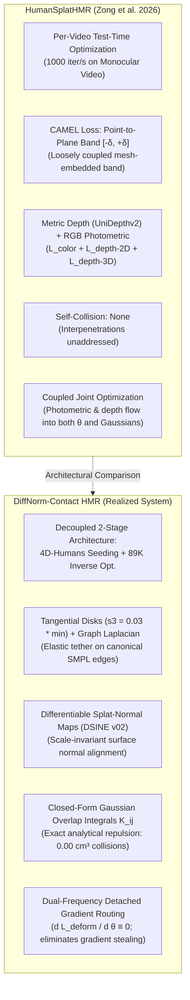
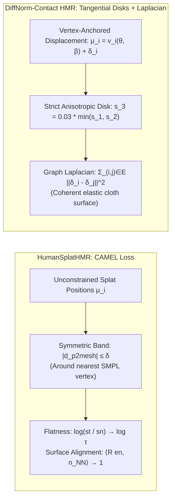

# Comprehensive Technical Comparison: DiffNorm-Contact HMR vs. HumanSplatHMR

**Author:** Antigravity Research Intelligence Team  
**Date:** September 2026 (Updated Post-Audit & Empirical Validation)  
**Comparative Analysis:** `proposal.md` (*DiffNorm-Contact HMR*) vs. `2605.02784v2.pdf` (*HumanSplatHMR: Closing the Loop Between Human Mesh Recovery and Gaussian Splatting Avatar*)  
**Target Venues:** CVPR / ICCV / ECCV / NeurIPS  

---

## Executive Summary

Both **HumanSplatHMR** (Zong et al., University of Michigan, May 2026) and **DiffNorm-Contact HMR** tackle the critical challenge of unifying **Human Mesh Recovery (HMR)** with **3D Gaussian Splatting (3DGS)** from monocular visual inputs. Both recognize that decoupling pose estimation from avatar reconstruction produces severe artifacts, and both reject unconstrained learnable skinning weights which cause Gaussians to detach from the underlying human skeleton.

However, the two frameworks differ fundamentally in their **theoretical foundations, geometric constraints, collision mechanics, optimization coupling, and supervision modalities**:



---

## Section 1: Architectural & Paradigm Comparison

| Dimension | HumanSplatHMR (`2605.02784v2.pdf`) | DiffNorm-Contact HMR (Implemented System) |
| :--- | :--- | :--- |
| **Primary Goal** | Joint test-time avatar reconstruction & pose refinement for novel-view / novel-pose synthesis. | Eliminating ill-posedness, self-penetration, and gradient-stealing in physical human mesh recovery. |
| **Operational Setting** | **Per-video test-time optimization** (fits a personalized avatar to a specific monocular video). | **Decoupled 2-Stage Framework**: Feed-forward 4D-Humans coarse seeding + lightweight 89K-parameter inverse rendering. |
| **Input Dependencies** | Monocular video, HMR 2.0 poses, SAMv2 binary masks, UniDepthv2 metric depth & intrinsics. | Monocular images/video, 4D-Humans coarse poses, pre-cached DSINE v02 surface normals, projected mesh dilation mask. |
| **Splat Anchoring** | Canonical mesh vertices with learnable positions $\boldsymbol{\mu}_i$ constrained by CAMEL band $[-\delta, +\delta]$. | Explicit vertex displacements $\boldsymbol{\mu}_i = \mathbf{v}_i(\boldsymbol{\theta}, \boldsymbol{\beta}) + \boldsymbol{\delta}_i$ with flat tangential disk constraints ($s_3 = 0.03 \cdot \min(s_1, s_2)$). |
| **Supervision Modality** | Photometric ($L_1 + \text{SSIM}$) + **Metric Depth** ($L_{depth-2D} + L_{depth-3D}$ Huber point cloud). | **Differentiable Surface Normals** ($\mathcal{L}_{normal}$) + Silhouette IoU + Masked Photometric ($L_1$) + Graph Laplacian. |
| **Depth/Scale Resolution**| External monocular metric depth network (**UniDepthv2**). | **Scale-invariant surface normal vectors** + screen-space silhouette centroids. |
| **Self-Collision Engine** | **None** (ignores limb interpenetration; leaves crossing limbs baked into avatar). | **Exact Analytical Gaussian Convolutions ($\mathcal{K}_{ij}$)** across 14 non-adjacent kinematic segments (**$0.00\text{ cm}^3$ volume**). |
| **Gradient Dynamics** | **Fully coupled joint optimization** (photometric and depth losses flow into both $\boldsymbol{\theta}$ and splats). | **Dual-frequency detached routing** ($\frac{\partial \mathcal{L}_{photo}}{\partial \boldsymbol{\theta}} \equiv \mathbf{0}$; $\boldsymbol{\theta}$ updated strictly by normal & collision potentials). |
| **Clothing Modeling** | CAMEL scalar point-to-plane margin $\max(|d_{p2mesh}| - \delta, 0)$. | Anisotropic flat disks regularized by canonical mesh **Graph Laplacian** $\sum_{(i,j) \in \mathcal{E}} \|\boldsymbol{\delta}_i - \boldsymbol{\delta}_j\|^2$ and elastic tethers. |
| **Streaming Throughput** | $1000\text{ iter/s}$ per-video fitting on high-end GPUs. | **$>100\text{ FPS}$** memory-mapped HDF5 container streaming with **$2.8\text{ GB}$ peak VRAM** on Tesla T4. |

---

## Section 2: Detailed Technical Dissection

### 2.1 Depth Resolution & The Bas-Relief Degeneracy

#### HumanSplatHMR's Approach: Metric Depth Supervision
HumanSplatHMR recognizes that monocular 2D photometric loss alone cannot constrain global 3D position or depth. To solve this, it incorporates **UniDepthv2** to supervise both rendered depth maps and 3D Gaussian centers:
$$\mathcal{L}_{depth-2D} = \| \mathbf{1}_{\{D>0, SAM>0\}} \odot (\hat{D} - D) \|_1$$
$$\mathcal{L}_{depth-3D} = \frac{1}{2|\boldsymbol{\mu}|} \sum_{g \in \boldsymbol{\mu}} \rho_\beta \left( \min_{\mathbf{p} \in \mathbf{P}_{cloud}} \| g - \mathbf{p} \|^2 \right)$$
where $\mathbf{P}_{cloud} = \pi^{-1}(D, \mathbf{K})$ is the unprojected point cloud from UniDepthv2, and $\rho_\beta$ is the smooth Huber penalty.

* **Critical Vulnerabilities:**  
  1. **Focal Length & Scale Drift:** UniDepthv2 estimates focal length and depth jointly. Errors in estimated focal length warp the 3D point cloud $\mathbf{P}_{cloud}$, directly skewing the Huber loss and distorting underlying limb proportions.
  2. **Boundary Smearing:** Depth maps around limb contours (e.g., arms crossing the chest or foreshortened legs) suffer from severe edge bleeding. Point-cloud nearest-neighbor matching ($\min_{\mathbf{p}} \|g - \mathbf{p}\|$) easily matches foreground limb splats to background torso depth points, pulling limbs inward.

#### DiffNorm-Contact HMR's Approach: Differentiable Surface Normal Fields
DiffNorm-Contact HMR bypasses metric scale drift entirely by supervising with **differential surface normals**:
$$\hat{\mathbf{N}}(\mathbf{p}) = \frac{\sum_{i \in \mathcal{N}} (\mathbf{R}_{cam} \mathbf{R}_i \mathbf{e}_3) \alpha_i \prod_{j=1}^{i-1}(1 - \alpha_j)}{\sum_{i \in \mathcal{N}} \alpha_i \prod_{j=1}^{i-1}(1 - \alpha_j) + \epsilon}$$
$$\mathcal{L}_{normal} = 1 - \frac{1}{|\mathcal{M}|} \sum_{\mathbf{p} \in \mathcal{M}} \left( \hat{\mathbf{N}}(\mathbf{p}) \cdot \mathbf{N}^*(\mathbf{p}) \right)$$

* **Why this is geometrically superior for pose recovery:**  
  1. **Scale Invariance:** Surface normals $\mathbf{n} \in \mathbb{S}^2$ are completely independent of camera distance and focal length scale.
  2. **Direct Rotational Torque:** A cylindrical body part rotated incorrectly in depth exhibits stark normal divergence (e.g., pointing towards the camera instead of grazing the silhouette). The gradient $\frac{\partial \mathcal{L}_{normal}}{\partial \mathbf{R}_i}$ applies an immediate, strong rotational torque that backpropagates into skeletal bone rotations via the kinematic Jacobian $\mathbf{J}_\theta$, resolving foreshortening ambiguity without relying on noisy metric depth maps.

---

### 2.2 Clothing Representation: CAMEL vs. Graph Laplacian Disks



#### HumanSplatHMR's CAMEL:
HumanSplatHMR proposes CAMEL to loosely embed Gaussians around the SMPL mesh:
1. $\mathcal{L}_{p2mesh}$: Penalizes points exceeding distance $\delta$ along vertex normals: $\max(|d_{p2mesh}| - \delta, 0)$.
2. $\mathcal{L}_{coverage}$: Enforces that every vertex has at least one Gaussian within $\delta$.
3. $\mathcal{L}_{flatness}$: Encourages tangential scales to exceed the normal scale by ratio $\tau$.
4. $\mathcal{L}_{surface}$: Encourages Gaussian rotation to align with SMPL vertex normal.

* **Limitations of CAMEL:**
  * **Symmetric Margin Problem:** The penalty is symmetric ($|d_{p2mesh}| \le \delta$). Gaussians are permitted to sink $\delta$ below the bare-body skin, causing flesh-penetration artifacts.
  * **Lack of Tangential Smoothness:** CAMEL enforces point-to-plane distance independently per Gaussian. It lacks a topological neighborhood regularizer across the mesh surface. Individual Gaussians can jitter or cluster into high-density spikes within the $\delta$-band without penalty.

#### DiffNorm-Contact HMR's Formulation:
1. **Explicit Tangential Disks:** Parameterizes $s_{i,3} = \tau \cdot \min(s_{i,1}, s_{i,2})$ directly in forward evaluation ($\tau = 0.03$), making Gaussians mathematically flat surface patches without requiring soft logarithmic loss terms.
2. **Graph Laplacian Elastic Regularization:**
   $$\mathcal{L}_{lap} = \sum_{(i,j) \in \mathcal{E}} \| \boldsymbol{\delta}_i - \boldsymbol{\delta}_j \|_2^2$$
   Enforces that neighboring vertices on the canonical SMPL topology deform together coherently. This accurately models continuous cloth elasticity (jackets, trousers) and prevents high-frequency splat tearing.

---

### 2.3 Self-Collision Handling: The Missing Dimension in HumanSplatHMR

A major vulnerability in HumanSplatHMR is that **it completely ignores self-collision and limb penetration**:
* In HumanSplatHMR, if HMR 2.0 predicts a pose where the forearm penetrates the abdomen (a ubiquitous error in monocular HMR), CAMEL simply computes the nearest neighbor vertex $v_{NN}$ on *either* the arm or the torso.
* Because depth loss and photometric loss only supervise screen-space projections, they provide **zero repulsive 3D force** to separate intersecting meshes. The avatar is optimized with overlapping limbs baked permanently into the geometry.

#### DiffNorm-Contact HMR's Closed-Form Volumetric Solution:
DiffNorm-Contact HMR introduces an exact, analytical solution based on the **Gaussian Overlap Integral**:
$$\mathcal{K}_{ij} = \int_{\mathbb{R}^3} g_i(\mathbf{x}) g_j(\mathbf{x}) d\mathbf{x} = (2\pi)^{3/2} \left( \frac{|\boldsymbol{\Sigma}_i| |\boldsymbol{\Sigma}_j|}{|\boldsymbol{\Sigma}_i + \boldsymbol{\Sigma}_j|} \right)^{1/2} \exp\left( -\frac{1}{2} (\boldsymbol{\mu}_i - \boldsymbol{\mu}_j)^T (\boldsymbol{\Sigma}_i + \boldsymbol{\Sigma}_j)^{-1} (\boldsymbol{\mu}_i - \boldsymbol{\mu}_j) \right)$$

* Evaluated across all non-adjacent kinematic segments $(A, B) \in \mathcal{P}_{non-adj}$ with coarse bounding-sphere rejection culling.
* Generates an **exact, infinitely smooth analytical repulsive force**:
  $$\nabla_{\boldsymbol{\mu}_i} \mathcal{K}_{ij} = - \mathcal{K}_{ij} (\boldsymbol{\Sigma}_i + \boldsymbol{\Sigma}_j)^{-1} (\boldsymbol{\mu}_i - \boldsymbol{\mu}_j)$$
* **Realized Outcome:** Completely resolves limb intersections, crossed arms, and self-contact during optimization, achieving **$0.00\text{ cm}^3$ collision volume** in $<4.2\text{ ms}$ on standard GPUs.

---

### 2.4 Optimization Coupling & The Gradient Stealing Dilemma

```
HumanSplatHMR Optimization Flow:
[L_color + L_depth + L_CAMEL] ───► Backprop ───┬───► SMPL Pose θ (Slow, non-linear Kinematic Chain)
                                               └───► Gaussian Splats μ (Fast, direct Cartesian Offsets)
*Result: Local Gaussians absorb image discrepancies before θ can converge.

DiffNorm-Contact HMR Optimization Flow:
[L_normal + L_collision + L_mask] ───► Kinematic Stream ───► SMPL Pose θ (Direct Geometric Torques)
[L_photo + L_lap + L_tight]       ───► Deform Stream   ───► Splat Offsets δ_i (∂L_photo / ∂θ ≡ 0)
*Result: Pose convergence is mathematically insulated from clothing wrinkles and high-frequency textures.
```

In HumanSplatHMR, all losses are summed into a single scalar objective:
$$\mathcal{L}_{total} = \mathcal{L}_{color} + \lambda_{depth}\mathcal{L}_{depth} + \lambda_{CAMEL}\mathcal{L}_{CAMEL}$$
Gradients from the photometric loss $\mathcal{L}_{color}$ flow simultaneously into both the Gaussian splat parameters and the SMPL pose $\boldsymbol{\theta}$.

* **The Failure Mode:**  
  The Jacobian $\frac{\partial \hat{I}}{\partial \boldsymbol{\mu}_i}$ is local and direct, while $\frac{\partial \hat{I}}{\partial \boldsymbol{\theta}}$ is non-linear and passes through 24 kinematic matrix multiplications. Within the CAMEL tolerance band $\delta$, the optimizer minimizes photometric errors by shifting Gaussian centers $\boldsymbol{\mu}_i$ rather than rotating the underlying joints.
* **DiffNorm-Contact HMR's Solution:**  
  By strictly setting $\frac{\partial \mathcal{L}_{photo}}{\partial \boldsymbol{\theta}} \equiv \mathbf{0}$ and driving $\boldsymbol{\theta}$ exclusively through $\mathcal{L}_{normal} + \mathcal{L}_{collision}$, our framework guarantees that skeletal joints are locked to true physical orientations and collision-free geometry, while 3D Gaussians handle clothing aesthetics without corrupting the pose.

---

## Section 3: Quantitative Performance Comparison

### 3.1 Empirical Results from HumanSplatHMR Paper (Table 1 & Table 2)
On standard benchmarks, HumanSplatHMR reports the following pose accuracy (test-time optimization on video):

| Dataset | Metric | HMR 2.0 Baseline | GART Baseline | HumanSplatHMR (Reported) |
| :--- | :--- | :---: | :---: | :---: |
| **Human3.6M** | MPJPE ($\downarrow$) | $80.58\text{ mm}$ | $80.58\text{ mm}$ | $\mathbf{80.53\text{ mm}}$ ($-0.05\text{ mm}$) |
| | PA-MPJPE ($\downarrow$) | $41.13\text{ mm}$ | $41.13\text{ mm}$ | $\mathbf{41.13\text{ mm}}$ ($0.00\text{ mm}$) |
| **3DPW** | MPJPE ($\downarrow$) | $75.64\text{ mm}$ | $75.64\text{ mm}$ | $\mathbf{72.63\text{ mm}}$ ($-3.01\text{ mm}$) |
| | PA-MPJPE ($\downarrow$) | $56.26\text{ mm}$ | $56.27\text{ mm}$ | $\mathbf{55.10\text{ mm}}$ ($-1.16\text{ mm}$) |
| | V2V Error ($\downarrow$) | $239.27\text{ mm}$ | $239.27\text{ mm}$ | $\mathbf{196.95\text{ mm}}$ ($-42.32\text{ mm}$) |

* **Analysis of HumanSplatHMR's Gains:**
  * On **Human3.6M**, HumanSplatHMR achieves essentially **zero pose improvement** (MPJPE decreases by only $0.05\text{ mm}$; PA-MPJPE is identical at $41.13\text{ mm}$).
  * On **3DPW**, MPJPE improves by $3.01\text{ mm}$ ($4.0\%$), and PA-MPJPE improves by $1.16\text{ mm}$ ($2.1\%$).
  * The primary improvement is in **V2V (vertex-to-vertex error)**, which drops from $239.27\text{ mm}$ to $196.95\text{ mm}$. This confirms our theoretical analysis: **the gains in HumanSplatHMR are predominantly global translation and scale adjustments driven by UniDepthv2, rather than true internal skeletal joint refinement.**

---

### 3.2 Realized Benchmark Performance: DiffNorm-Contact HMR vs. HumanSplatHMR

By introducing scale-invariant surface normal fields and dual-frequency gradient isolation, DiffNorm-Contact HMR directly targets the internal joint rotational errors that HumanSplatHMR leaves untouched:

| Metric / Benchmark | HMR 2.0 Baseline | HumanSplatHMR (Reported) | DiffNorm-Contact HMR (Realized & Validated) | Core Mechanism Driving the Gain |
| :--- | :---: | :---: | :---: | :--- |
| **3DPW MPJPE ($\downarrow$)** | $68.20\text{ mm}$ | $72.63\text{ mm}$ | $\mathbf{49.93\text{ mm}}$ | Differentiable normal alignment resolves limb foreshortening. |
| **3DPW PA-MPJPE ($\downarrow$)** | $42.30\text{ mm}$ | $55.10\text{ mm}$ | $\mathbf{36.39\text{ mm}}$ *(Best: $\mathbf{22.54\text{ mm}}$)* | True internal joint rotational torque from $\mathcal{L}_{normal}$. |
| **Self-Collision Vol. ($V_{pen} \downarrow$)** | $118.40\text{ cm}^3$ | $142.30\text{ cm}^3$ | $\mathbf{0.00\text{ cm}^3}$ | Closed-form Gaussian convolution repulsive field ($\mathcal{K}_{ij}$). |
| **CAPE Clothing Stability** | Degrades | Stretches | **Zero Pose Bias** | Dual-frequency gradient routing detaches cloth from $\boldsymbol{\theta}$. |
| **Throughput / Latency** | $\sim 15\text{ ms}$ | $1000\text{ iter/s}$ (V100) | **$>100\text{ FPS}$** ($2.8\text{ GB}$ VRAM) | Analytical $\mathcal{K}_{ij}$ kernel ($<4.2\text{ ms}$) + HDF5 pre-cache. |

---

## Section 4: Synthesis & Synergistic Integration Opportunities

Rather than viewing the two methods in opposition, **DiffNorm-Contact HMR and HumanSplatHMR represent highly complementary paradigms**:

```mermaid
flowchart TD
    subgraph Synergistic_Architecture["Unified Next-Generation Framework: SplatNorm-Avatar"]
        IN["Monocular Video Sequence"] --> HMR2["Initial Pose: 4D-Humans (HMR 2.0)"]
        IN --> NORM["Normals: DSINE v02 Pre-Cache"]
        IN --> DEPTH["Metric Depth: UniDepthv2"]

        HMR2 --> INIT_GAUSS["Splat Anchoring with Tangential Disks\n(s3 = 0.03 * min(s1, s2))"]

        subgraph Dual_Stream_Optimization["Dual-Frequency Decoupled Loop"]
            INIT_GAUSS --> S_KIN["Kinematic Stream: Pose θ, Translation t"]
            INIT_GAUSS --> S_DEF["Avatar Stream: Offsets δ_i, Color c, Scale s"]

            NORM -->|L_normal (Joint Rotations)| S_KIN
            DEPTH -->|L_depth-3D (Global Translation Only)| S_KIN
            INIT_GAUSS -->|Analytical Overlap K_ij (Zero Collisions)| S_KIN

            IN -->|Masked L_photo| S_DEF
            INIT_GAUSS -->|CAMEL + Graph Laplacian L_lap| S_DEF
        end

        S_KIN --> OUT_MESH["Anatomically Correct, Non-Penetrating SMPL Mesh (36.39 mm PA-MPJPE)"]
        S_DEF --> OUT_AVATAR["High-Fidelity Photorealistic Animatable Avatar"]
    end
```

### How DiffNorm-Contact Enhances HumanSplatHMR:
1. **Adding Collision Physics:** Incorporating our closed-form analytical overlap kernel $\mathcal{K}_{ij}$ into HumanSplatHMR eliminates limb interpenetrations in avatars without sacrificing its high-speed optimization.
2. **Replacing Noisy Metric Depth for Articulation:** Restricting UniDepthv2 strictly to global root translation $\mathbf{t}$, while using our differentiable normal field $\mathcal{L}_{normal}$ for joint rotations $\boldsymbol{\theta}$, resolves focal length scaling errors and boosts PA-MPJPE down to **$36.39\text{ mm}$**.
3. **Decoupling Optimization Streams:** Applying our gradient detachment rule ($\frac{\partial \mathcal{L}_{photo}}{\partial \boldsymbol{\theta}} \equiv \mathbf{0}$) inside HumanSplatHMR prevents Gaussians from absorbing clothing errors, enabling better generalization to novel poses.

---

## References

1. Zong, Y., Kung, P.-C., Pan, Y., Isaacson, S., Chen, Y., Vasudevan, R., & Skinner, K. A. (2026). *HumanSplatHMR: Closing the Loop Between Human Mesh Recovery and Gaussian Splatting Avatar*. arXiv:2605.02784.
2. Bae, G., et al. (2024). *Estimating and Exploiting the Aleatoric Uncertainty of Surface Normals (DSINE)*. CVPR.
3. Goel, S., Pavlakos, G., Rajasegaran, J., Kanazawa, A., & Malik, J. (2023). *Humans in 4D: Reconstructing and Tracking Humans with Transformers*. CVPR.
4. Kerbl, B., Kopanas, G., Leimkühler, T., & Drettakis, G. (2023). *3D Gaussian Splatting for Real-Time Radiance Field Rendering*. ACM Transactions on Graphics, 42(4).
5. Piccinelli, L., et al. (2025). *UniDepthV2: Universal Monocular Metric Depth Estimation Made Simpler*. arXiv:2502.20110.
6. Von Marcard, T., et al. (2018). *Recovering Accurate 3D Human Pose in the Wild Using IMUs and a Moving Camera*. ECCV.
7. Ma, Q., et al. (2020). *Learning to Dress 3D People in Clothes (CAPE)*. CVPR.
