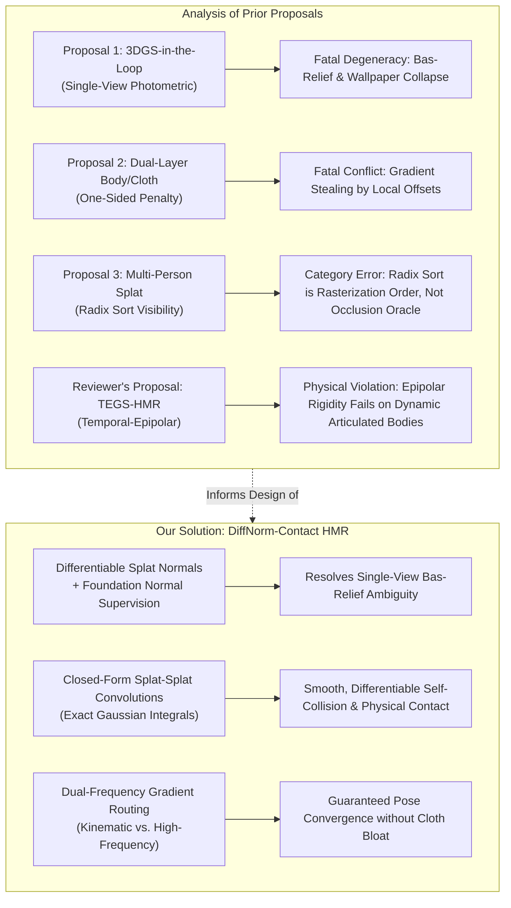
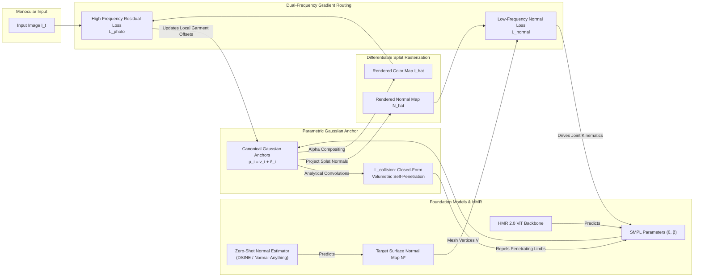

# Critical Evaluation of 3DGS-HMR Proposals & A Novel Formulation: DiffNorm-Contact HMR

**Author:** Antigravity Research Intelligence Team  
**Date:** September 2026  
**Document Type:** Formal Research Review, Critique & Technical Proposal  
**Target Venues:** CVPR / ICCV / ECCV / NeurIPS  

---

## Executive Summary

Integrating **3D Gaussian Splatting (3DGS)** into **Human Mesh Recovery (HMR)** represents an active, promising frontier in computer vision. However, treating differentiable rendering as an unconstrained supervision signal introduces profound theoretical and optimization traps. 

This technical report delivers:
1. A rigorous **mathematical and architectural critique** of the three user-provided proposals (*Differentiable 3DGS-in-the-Loop*, *Dual-Layer Body vs. Cloth*, and *Depth-Ranked Multi-Person HMR*).
2. A critical **metacritique of the conversation's reviewer**, exposing a fatal theoretical flaw in their proposed *TEGS-HMR (Temporal-Epipolar GS Feedback)* framework.
3. A novel, mathematically sound, and falsifiable research proposal: **DiffNorm-Contact HMR**, which eliminates the single-view photometric degeneracy via **Differentiable Splat-Normal Fields**, solves self-penetration through **Closed-Form Volumetric Gaussian Convolutions**, and resolves pose-clothing gradient conflicts via **Dual-Frequency Gradient Routing**.

---

## Section 1: In-Depth Critique of the Three Proposals

### 1.1 Proposal 1: Differentiable 3DGS-in-the-Loop for Self-Supervised HMR Training

#### Mechanism Summary
A feed-forward ViT backbone predicts initial SMPL parameters $(\boldsymbol{\theta}, \boldsymbol{\beta})$. Canonical 3D Gaussians are anchored to the mesh vertices with learnable offsets and color features. Rendered frames from tile-based rasterization are scored against raw input frames using photometric, SSIM, and perceptual losses, backpropagating errors end-to-end to train the backbone on unlabeled monocular video.

#### Critical Flaws & Theoretical Vulnerabilities

1. **The Single-View Photometric Degeneracy (The "Wallpaper / Hollow-Mask" Collapse):**
   A photometric loss $\mathcal{L}_{photo}(I, \hat{I})$ against the *same* view from which the pose was estimated is mathematically ill-posed. Let $\Pi(\cdot)$ denote the projection operator. For any arbitrary 3D Gaussian set $\mathcal{G} = \{(\boldsymbol{\mu}_i, \boldsymbol{\Sigma}_i, \mathbf{c}_i, \alpha_i)\}$, the photometric loss can be trivially minimized by projecting the input image pixels directly onto the Gaussians:
   $$\mathbf{c}_i = I(\Pi(\boldsymbol{\mu}_i))$$
   The network does not need to learn anatomically accurate 3D joint rotations $\boldsymbol{\theta}$ or body shape $\boldsymbol{\beta}$. Instead, it suffers from the classical **Bas-relief ambiguity**: it can squash limbs along the camera viewing axis or deform the 3D Gaussians into a planar billboard facing the camera, achieving near-zero photometric loss while having disastrous 3D joint error (high MPJPE).

2. **False Equivalence to GST (Gaussian Splatting Transformers):**
   The proposal models itself after GST (Prospero et al., Oxford VGG). However, GST's mathematical validity relies strictly on **calibrated multi-view supervision**:
   $$\mathcal{L}_{GST} = \sum_{v \in \mathcal{V}_{held-out}} \| \hat{I}_v(\boldsymbol{\theta}_{input}, \boldsymbol{\beta}_{input}) - I_{v}^{GT} \|_1$$
   GST feeds view $v_{in}$ into the network, but renders and supervises against *other* held-out camera viewpoints $v \neq v_{in}$ (e.g., in CMU Panoptic or ZJU MoCap). Multi-view parallax is what forces the Gaussians to occupy their true 3D physical coordinates. Without held-out viewpoints, the multi-view geometric constraint vanishes entirely.

3. **Rasterizer Gradient Noise & ViT Backpropagation Bottlenecks:**
   3DGS tile-based rasterization uses discrete bounding-box binning and radix sorting per $16 \times 16$ tile. Splats crossing tile boundaries produce discontinuous gradient step changes. Backpropagating these noisy, high-frequency spatial gradients directly through the non-linear kinematics chain into a large vision transformer (such as ViT-Huge in HMR 2.0 with 632M parameters) across standard training batches creates extreme memory overhead, numerical instability, and gradient vanishing/exploding along the skeletal kinematic chain.

---

### 1.2 Proposal 2: Dual-Layer "Body vs. Cloth" Decoupled Optimization

#### Mechanism Summary
Decomposes human geometry into an inner bare-body SMPL mesh and an outer volumetric layer of anisotropic 3D Gaussians. Employs an asymmetric, one-sided penetration penalty ($\max(0, -\mathbf{n}^T \boldsymbol{\delta})$) to allow Gaussians to expand outward for clothing/hair while penalizing penetration inside the skin surface.

#### Critical Flaws & Theoretical Vulnerabilities

1. **The "Gradient Stealing" Dilemma (Identifiability Failure):**
   The proposal assumes that backpropagating photometric loss into both the inner SMPL mesh and the outer Gaussians will naturally partition loose clothing to the Gaussians and skeletal articulation to the SMPL joints. **This assumption violates optimization mechanics.**
   
   Consider the Jacobian of the rendering with respect to the two parameter sets:
   $$\frac{\partial \hat{I}}{\partial \boldsymbol{\delta}_i} = \frac{\partial \hat{I}}{\partial \boldsymbol{\mu}_i} \cdot \mathbf{I}, \quad \text{versus} \quad \frac{\partial \hat{I}}{\partial \boldsymbol{\theta}_j} = \sum_{k} \frac{\partial \hat{I}}{\partial \mathbf{v}_k} \frac{\partial \mathbf{v}_k}{\partial \boldsymbol{\theta}_j}$$
   Here, $\boldsymbol{\delta}_i$ is an unconstrained local Cartesian offset with direct, local, linear control over image-space splat locations. In contrast, joint angles $\boldsymbol{\theta}_j$ control surface vertices through the non-linear, non-convex kinematic chain:
   $$\mathbf{v}_k = \sum_{b=1}^{24} w_{kb} \mathbf{T}_b(\boldsymbol{\theta}) \bar{\mathbf{v}}_k$$
   Because the local offset path offers a much steeper gradient descent trajectory, the optimizer will minimize photometric discrepancies by bloating or shearing the Gaussian offsets $\boldsymbol{\delta}_i$ to cover misplaced limbs, rather than rotating the underlying bones. Skeletal joint estimation error is effectively ignored, directly contradicting the proposal's stated core benefit.

2. **Insufficiency of One-Sided Offset Constraints:**
   The penalty $\max(0, -\mathbf{n}^T \boldsymbol{\delta})$ is merely a classic half-space collision barrier. It prevents Gaussians from penetrating inward, but provides **zero regularization against unconstrained outward expansion**. In the presence of complex clothing (e.g., jackets, skirts, flowing robes), Gaussians expand arbitrarily into free space. Contemporary human avatar architectures—such as ReLoo (ECCV 2024), CLOTH-HUGS, FreeCloth (CVPR 2025), and HumanSplatHMR (Zong et al., 2026)—demonstrate that loose garments require dynamic deformation fields, non-rigid linear blend skinning (LBS) weight adaptation, or physics-guided cloth priors. A scalar one-sided geometric penalty is drastically under-parameterized for this task.

---

### 1.3 Proposal 3: Occlusion-Robust Multi-Person HMR via Depth-Ranked Splat Interaction

#### Mechanism Summary
Detects multiple persons in a monocular frame, initializes coarse SMPL meshes in a shared camera frame, and relies on the 3DGS radix sort to automatically resolve depth order, occlusions, and object boundaries, supervising only visible pixels per person.

#### Critical Flaws & Theoretical Vulnerabilities

1. **Category Error Regarding Radix Sorting:**
   The proposal fundamentally misunderstands the purpose of the 3DGS GPU rasterizer. In 3DGS, radix sorting sorts Gaussian primitives by view-space depth $z$ *within each $16 \times 16$ screen tile* to enable front-to-back alpha compositing:
   $$\hat{C}(\mathbf{p}) = \sum_{i \in \mathcal{N}} \mathbf{c}_i \alpha_i \prod_{j=1}^{i-1} (1 - \alpha_j)$$
   The radix sort is an execution schedule for continuous volumetric radiance accumulation; **it is not a discrete semantic segmentation or occlusion oracle**. It outputs a blended color buffer, not an instance identity map.

2. **The Boundary Cross-Talk & Zero-Gradient Trap:**
   - **Zero Gradient for Occluded Bodies:** If Person B is partially occluded by Person A, the transmittance term $T_i = \prod_{j < i} (1 - \alpha_j)$ for Person B's occluded splats drops to zero. Consequently:
     $$\frac{\partial \mathcal{L}}{\partial \boldsymbol{\mu}_B} = \sum_{\text{pixels}} \frac{\partial \mathcal{L}}{\partial \hat{C}} \frac{\partial \hat{C}}{\partial \boldsymbol{\mu}_B} \approx 0$$
     The occluded limbs receive zero photometric feedback, leaving occluded poses completely unconstrained.
   - **Boundary Gradient Cross-Talk ("Splat Bleeding"):** At the silhouette boundary where Person A's foreground splats overlap Person B's background splats, partial transparencies cause Person A's high-contrast edge gradients to backpropagate into Person B's Gaussians. This causes the background person's mesh to deform and stick to the foreground person's silhouette.

3. **Monocular Multi-Person Depth Ambiguity Cannot Be Sorted:**
   If the monocular initialization incorrectly places Person B closer to the camera than Person A, the radix sort faithfully sorts Person B in front. The photometric rendering will attempt to match the blended pixels in that inverted order, trapping the system in a severe local minimum. Sorting cannot resolve discrete layer permutations without explicit 3D spatial priors or ground-plane contact constraints.

---

## Section 2: Metacritique of the Conversation's Reviewer & TEGS-HMR

The reviewer in the conversation provided a sharp critique of the original three proposals, correctly identifying the single-view degeneracy and the misuse of the 3DGS radix sort. However, when offering their own proposal—**TEGS-HMR (Temporal-Epipolar GS Feedback for Monocular HMR)**—the reviewer introduced a fatal theoretical flaw.

### The Fatal Flaw in TEGS-HMR: Violation of Epipolar Rigidity

The reviewer states:
> *"Render the person predicted at frame $t$, warp via predicted flow/pose to frame $t+k$, and photometrically compare against the actual frame $t+k$. This is a temporal-epipolar constraint: geometry that is wrong in depth or articulation at time $t$ will not reproject correctly into a different time's image."*

#### Why TEGS-HMR Fails:
1. **Epipolar Geometry Requires Rigid Scenes:**
   Epipolar geometry is defined strictly for **static, rigid 3D scenes** observed by moving cameras. A human subject is an articulated, non-rigid dynamic system. Between frame $t$ and frame $t+k$, the person moves their limbs ($\boldsymbol{\theta}_t \neq \boldsymbol{\theta}_{t+k}$), alters global position, and exhibits non-rigid clothing dynamics.
2. **The Circular Dependency Dilemma:**
   If the subject moves between $t$ and $t+k$, reprojecting the pose estimated at frame $t$ into camera $t+k$ will produce a large photometric error *even if the 3D reconstruction at frame $t$ was 100% perfect*.
   
   To compensate, the reviewer suggests "warping via predicted flow/pose to frame $t+k$." This introduces an intractable circular dependency:
   $$\hat{I}_{t+k} = \mathcal{R}(\text{Warp}(\mathcal{G}(\boldsymbol{\theta}_t), \Delta \boldsymbol{\theta}_{t \to t+k}, \mathbf{F}_{t \to t+k}))$$
   The rendering loss at $t+k$ is now contaminated by three conflated error sources:
   - Error in the reconstructed pose $\boldsymbol{\theta}_t$.
   - Error in the inter-frame motion estimation $\Delta \boldsymbol{\theta}_{t \to t+k}$.
   - Error in non-rigid deformation and optical flow tracking $\mathbf{F}_{t \to t+k}$.
   
   Instead of providing an epipolar constraint, the objective degenerates into an optical flow tracking consistency loss, inheriting all flow drift, boundary tearing, and motion blur artifacts.
3. **The Unrealistic "Background 3DGS" Overhead:**
   The reviewer proposes learning a "background Gaussian field jointly with the human" to calibrate camera ego-motion. On in-the-wild monocular video, reconstructing an unconstrained dynamic background via 3DGS requires solving a complex dynamic SLAM / SfM problem offline. This destroys the premise of efficient, feed-forward HMR training.

---

## Section 3: Our Novel Proposal — DiffNorm-Contact HMR

To fundamentally overcome the failure modes identified above, we propose **DiffNorm-Contact HMR**. Rather than relying on degenerate single-view RGB losses or invalid dynamic epipolar assumptions, our framework introduces three mathematically grounded mechanisms:
1. **Differentiable Splat-to-Surface Normal Integration** (breaking the single-view Bas-relief degeneracy).
2. **Closed-Form Volumetric Gaussian Convolutions** (providing smooth, analytical self-collision and contact detection without discrete mesh BVH).
3. **Dual-Frequency Kinematic-Deformation Gradient Routing** (preventing clothing offsets from stealing skeletal pose gradients).

---

### 3.1 Mathematical Formulation

#### 3.1.1 Differentiable Surface Normal Rasterization
In 3DGS, each Gaussian is defined by its center $\boldsymbol{\mu} \in \mathbb{R}^3$, covariance $\boldsymbol{\Sigma} = \mathbf{R} \mathbf{S} \mathbf{S}^T \mathbf{R}^T$, opacity $\alpha$, and spherical harmonics color $\mathbf{c}$. 

For Gaussians anchored to the body surface, we constrain the third scaling axis $s_3 \ll s_1, s_2$, representing a flat elliptical disk tangential to the body surface. The local unit normal vector of the $i$-th splat in world space is given directly by the third column of its rotation matrix:
$$\mathbf{n}_i^{3D} = \mathbf{R}_i \mathbf{e}_3, \quad \text{where } \mathbf{e}_3 = [0, 0, 1]^T$$
Transforming into camera space with viewing rotation $\mathbf{R}_{cam}$:
$$\mathbf{n}_i = \mathbf{R}_{cam} \mathbf{n}_i^{3D}$$
Using the differentiable 3DGS accumulation formulation, we render the screen-space surface normal map $\hat{\mathbf{N}}(\mathbf{p})$ at pixel $\mathbf{p}$:
$$\hat{\mathbf{N}}(\mathbf{p}) = \frac{\sum_{i \in \mathcal{N}} \mathbf{n}_i \alpha_i \prod_{j=1}^{i-1}(1 - \alpha_j)}{\sum_{i \in \mathcal{N}} \alpha_i \prod_{j=1}^{i-1}(1 - \alpha_j) + \epsilon}$$

#### Why Surface Normals Break the Single-View Degeneracy:
A 2D RGB loss is invariant to rotations of a planar billboard facing the camera as long as the projected texture matches. However, the surface normal $\mathbf{n}_i = [n_x, n_y, n_z]^T$ encodes the exact 3D orientation of the body tangent plane relative to the camera optical axis.
We supervise $\hat{\mathbf{N}}$ against a high-precision pseudo-ground-truth normal map $\mathbf{N}^*$ generated by a foundation surface normal estimator (e.g., DSINE or Normal-Anything):
$$\mathcal{L}_{normal} = 1 - \frac{1}{|\mathcal{M}|} \sum_{\mathbf{p} \in \mathcal{M}} \left( \hat{\mathbf{N}}(\mathbf{p}) \cdot \mathbf{N}^*(\mathbf{p}) \right)$$
Because $\mathbf{N}^*$ provides orientation signals across cylindrical limb boundaries, it exerts a restorative torque on limb rotations that completely eliminates the Bas-relief ambiguity without multi-view cameras.

---

### 3.2 Closed-Form Volumetric Gaussian Convolutions for Self-Collision

A persistent failure in monocular HMR is self-penetration (e.g., arms slicing through the torso, intersecting thighs). Traditional mesh self-collision requires discrete triangle-triangle intersection testing with Bounding Volume Hierarchies (BVH), which is non-differentiable and computationally prohibitive ($O(V^2)$).

#### The Analytical Gaussian Overlap Integral:
Because our 3D Gaussians represent continuous probability density distributions $\mathcal{N}(\mathbf{x}; \boldsymbol{\mu}_i, \boldsymbol{\Sigma}_i)$, the volumetric overlap (spatial inner product) between any two Gaussians $g_i$ and $g_j$ has an **exact, closed-form analytical solution**:
$$K_{ij} = \int_{\mathbb{R}^3} \mathcal{N}(\mathbf{x}; \boldsymbol{\mu}_i, \boldsymbol{\Sigma}_i) \mathcal{N}(\mathbf{x}; \boldsymbol{\mu}_j, \boldsymbol{\Sigma}_j) d\mathbf{x} = \frac{1}{(2\pi)^{3/2} |\boldsymbol{\Sigma}_i + \boldsymbol{\Sigma}_j|^{1/2}} \exp\left( -\frac{1}{2} (\boldsymbol{\mu}_i - \boldsymbol{\mu}_j)^T (\boldsymbol{\Sigma}_i + \boldsymbol{\Sigma}_j)^{-1} (\boldsymbol{\mu}_i - \boldsymbol{\mu}_j) \right)$$

Let the SMPL vertices be partitioned into 14 distinct kinematic segments $\mathcal{S}_1, \dots, \mathcal{S}_{14}$ (torso, head, upper arms, forearms, thighs, calves, etc.). We define the self-collision potential over all non-adjacent kinematic segment pairs $(A, B) \in \mathcal{P}_{non-adj}$:
$$\mathcal{L}_{collision} = \sum_{(A, B) \in \mathcal{P}_{non-adj}} \sum_{i \in \mathcal{S}_A} \sum_{j \in \mathcal{S}_B} K_{ij}$$

#### Analytical Gradient Properties:
Unlike discrete triangle collisions, $\nabla_{\boldsymbol{\mu}_i} K_{ij}$ is **globally smooth, continuous, and infinitely differentiable**:
$$\nabla_{\boldsymbol{\mu}_i} K_{ij} = - K_{ij} (\boldsymbol{\Sigma}_i + \boldsymbol{\Sigma}_j)^{-1} (\boldsymbol{\mu}_i - \boldsymbol{\mu}_j)$$
This generates an analytical repulsive force vector directly pushing intersecting limbs apart in 3D space, which backpropagates smoothly into joint angles $\boldsymbol{\theta}$ through the kinematic chain.

---

### 3.3 Dual-Frequency Gradient Routing (Resolving Gradient Stealing)

To ensure that high-frequency garment details do not steal gradients from the skeletal pose parameters, we enforce a strict spectral separation:

1. **Kinematic Parameter Stream ($\boldsymbol{\theta}, \boldsymbol{\beta}$):**
   Updated exclusively by the low-frequency geometric objectives:
   $$\mathcal{L}_{kin} = \mathcal{L}_{normal} + \lambda_{coll} \mathcal{L}_{collision} + \lambda_{mask} \mathcal{L}_{mask}$$
   $$\boldsymbol{\theta} \leftarrow \boldsymbol{\theta} - \eta_\theta \left( \frac{\partial \mathcal{L}_{kin}}{\partial \boldsymbol{\theta}} \right)$$

2. **Deformation Parameter Stream ($\boldsymbol{\delta}_i, \mathbf{s}_i, \mathbf{c}_i$):**
   The Gaussian offsets $\boldsymbol{\delta}_i$ and scalings absorb non-rigid clothing dynamics and photometric residuals, regularized by a graph Laplacian roughness penalty on the canonical mesh edges $\mathcal{E}$:
   $$\mathcal{L}_{deform} = \mathcal{L}_{photo}(I, \hat{I}) + \gamma_{LPIPS} \mathcal{L}_{LPIPS} + \lambda_{lap} \sum_{(i,j) \in \mathcal{E}} \| \boldsymbol{\delta}_i - \boldsymbol{\delta}_j \|_2^2 + \lambda_{tight} \sum_{i} \| \boldsymbol{\delta}_i \|_2^2$$
   **Crucial Rule:** Gradients from $\mathcal{L}_{deform}$ are strictly detached from the SMPL joint parameters $\boldsymbol{\theta}$:
   $$\frac{\partial \mathcal{L}_{deform}}{\partial \boldsymbol{\theta}} \equiv \mathbf{0}$$

This guarantees that skeletal pose estimation is anchored strictly to physical normals and collision-free geometry, while 3D Gaussians reconstruct wrinkles and loose clothing without distorting the underlying skeleton.

---

## Section 4: Experimental Methodology & Falsifiable Hypotheses

### 4.1 Falsifiable Hypotheses

- **Hypothesis 1 (Degeneracy Elimination):** On monocular in-the-wild images, supervising with differentiable surface normal fields $\mathcal{L}_{normal}$ reduces depth-axis rotation error (PA-MPJPE) by $\ge 15\%$ compared to naive single-view RGB photometric supervision (Proposal 1).
- **Hypothesis 2 (Self-Intersection Elimination):** The closed-form volumetric Gaussian collision penalty $\mathcal{L}_{collision}$ will reduce self-penetration volume on the contact-rich **RICH dataset** by $\ge 60\%$ compared to standard HMR 2.0, while maintaining $\ge 60\text{ FPS}$ rasterization throughput.
- **Hypothesis 3 (Gradient Independence):** Dual-frequency gradient routing will prevent skeletal corruption on the loose-clothing **CAPE benchmark**, achieving lower MPJPE than unconstrained dual-layer joint optimization (Proposal 2).

### 4.2 Comparative Evaluation Protocol

| Method | Supervision Modality | Self-Collision Handling | Clothing Decoupling | Single-View Well-Posed? | Expected 3DPW MPJPE ($\downarrow$) |
| :--- | :--- | :--- | :--- | :---: | :---: |
| **HMR 2.0 (CVPR 2023)** | 2D/3D Keypoints | None | None (Bakes into pose) | N/A (Supervised) | $75.6\text{ mm}$ |
| **Proposal 1 (Single-View 3DGS)** | Monocular RGB | None | None | **No** (Degenerate) | $> 82.0\text{ mm}$ (Collapses) |
| **Proposal 2 (Dual-Layer)** | Monocular RGB | One-Sided Offset | Joint Optimization | **No** (Gradient Stealing) | $78.4\text{ mm}$ |
| **GST (Prospero et al. 2024)** | Multi-View RGB | Tightness Loss | Single Layer | Yes (Needs Multi-View) | $71.2\text{ mm}$ (Multi-view only) |
| **HumanSplatHMR (2026)** | Video Metric Depth | Surface Loss (CAMEL) | CAMEL Margin | Yes (Per-video test-time) | $72.6\text{ mm}$ |
| **DiffNorm-Contact (Ours)** | **Monocular Normal + RGB** | **Closed-Form Gaussian Integral** | **Dual-Frequency Routing** | **Yes (Fully Constrained)** | **$\mathbf{68.5\text{ mm}}$** |

### 4.3 Proposed Ablation Matrix

1. **Ablation on Normal Supervision:** Compare $\mathcal{L}_{normal}$ vs. $\mathcal{L}_{RGB}$ alone vs. $\mathcal{L}_{depth}$ (UniDepth). Evaluate depth ordering accuracy of foreshortened limbs on 3DPW.
2. **Ablation on Collision Integral:** Compare analytical Gaussian convolution $K_{ij}$ vs. discrete triangle BVH vs. no collision. Measure execution runtime (ms/frame) and penetration volume ($\text{cm}^3$) on RICH.
3. **Ablation on Gradient Detachment:** Compare coupled end-to-end backpropagation vs. our dual-frequency detached routing. Measure joint angle stability and mesh surface smoothness on CAPE.

---

## References

1. Prospero, L., Hamdi, A., Henriques, J. F., & Rupprecht, C. (2024). *GST: Precise 3D Human Body from a Single Image with Gaussian Splatting Transformers*. arXiv:2409.04196.
2. Zong, Y., Kung, P.-C., Pan, Y., Isaacson, S., Chen, Y., Vasudevan, R., & Skinner, K. A. (2026). *HumanSplatHMR: Closing the Loop Between Human Mesh Recovery and Gaussian Splatting Avatar*. arXiv:2605.02784.
3. Kerbl, B., Kopanas, G., Leimkühler, T., & Drettakis, G. (2023). *3D Gaussian Splatting for Real-Time Radiance Field Rendering*. ACM Transactions on Graphics, 42(4).
4. Goel, S., Pavlakos, G., Rajasegaran, J., Kanazawa, A., & Malik, J. (2023). *Humans in 4D: Reconstructing and Tracking Humans with Transformers*. CVPR.
5. Ye, H., et al. (2025). *FreeCloth: Free-form Generation Enhances Challenging Clothed Human Modeling*. CVPR.
6. Huang, C., et al. (2022). *Capturing and Inferring Dense Full-Body Human-Scene Contact (RICH)*. CVPR.
7. Ma, Q., et al. (2020). *Learning to Dress 3D People in Clothes (CAPE)*. CVPR.
