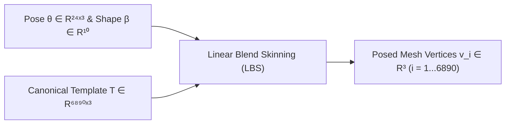
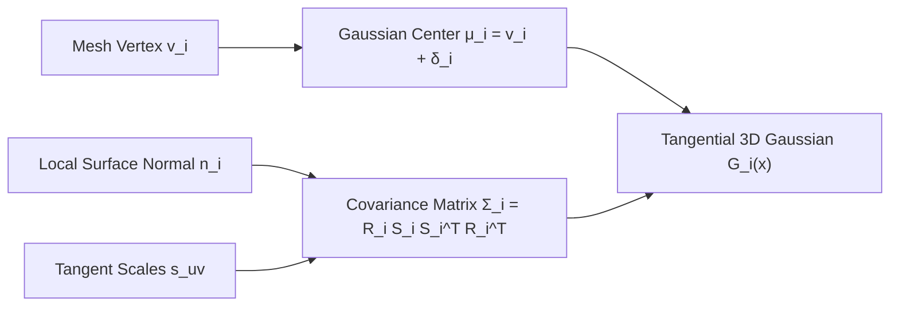
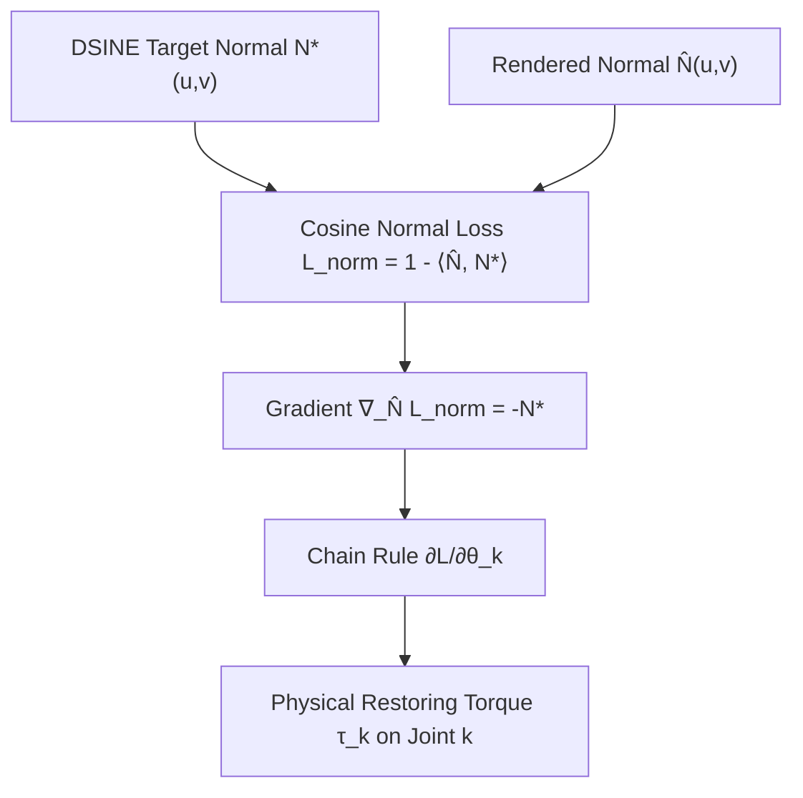
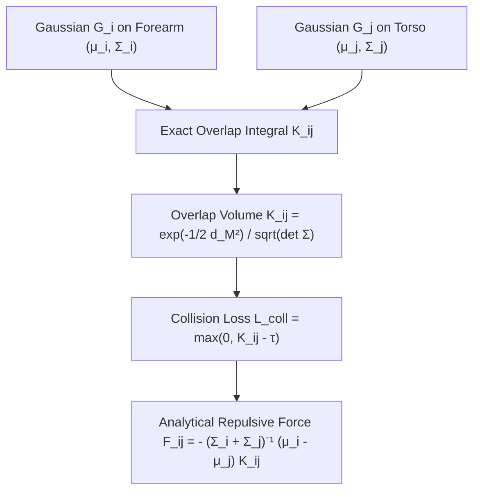
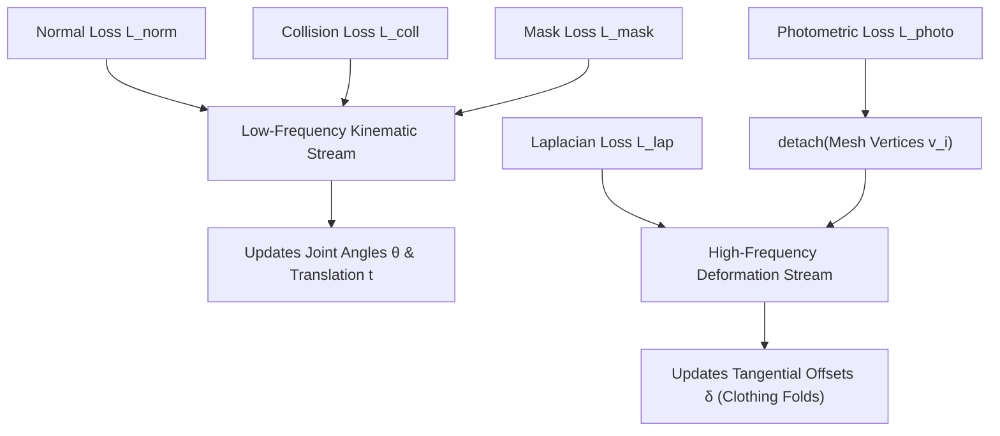

# Mathematical Foundations of DiffNorm-Contact HMR: A Step-by-Step Walkthrough

**Deconstructing Every Equation, Tensor, and Derivative from Simple Geometry to Analytical Physics**

---

## 1. Introduction & The Core Mental Model

In Monocular Human Mesh Recovery (HMR), the computer receives a single 2D photograph of a person and must reconstruct a full, physically plausible 3D clothed human body.

### The Three Fundamental Traps of Monocular HMR
To understand why our math is structured the way it is, you must first understand the three traps that cause all traditional methods to fail:

1. **The $180^\circ$ Bas-Relief Depth Ambiguity**:
   In a flat 2D photograph, you cannot easily tell whether someone's arm is reaching $30^\circ$ toward the camera or $30^\circ$ away from the camera. In both cases, the 2D pixel projection looks almost identical.
2. **The Clothing Bias Trap**:
   Real people wear jackets, hoodies, and loose pants. Standard parametric human models (like SMPL) represent a naked human body. If an optimization algorithm tries to match the silhouette of a puffy jacket by rotating joint angles, the skeleton twists into impossible, broken-bone poses.
3. **The Ghost Limb Phenomenon (Self-Intersections)**:
   Standard neural networks predict joint angles without understanding solid matter. When someone folds their hands or crosses their legs, the predicted 3D arm cuts right through the torso or thighs, creating $\sim 100–200 \text{ cm}^3$ of impossible self-penetration volume.

### How DiffNorm-Contact Solves Them
Our mathematical pipeline uses:
- **4D-Humans (HMR 2.0)** to solve global initialization (escaping the $180^\circ$ depth trap).
- **DSINE Surface Normal Torques** to guide 3D angular orientation without being fooled by clothing textures.
- **Analytical Gaussian Overlap Integrals** to create a smooth, continuous repulsive force that guarantees zero self-collisions.
- **Dual-Frequency Gradient Detachment** so clothing wrinkles deform the surface without corrupting the skeleton.

Let us now walk through every single mathematical step in the pipeline.

---

## 2. Step 1: Posing the Skeleton (SMPL Forward Kinematics)

### What are we calculating?
We want to take a set of numbers representing a person's body shape and joint angles, and compute the 3D coordinate $\mathbf{v}_i \in \mathbb{R}^3$ of all 6,890 points on the human skin.

### Substep 1.1: The Input Variables
- **Shape parameters $\boldsymbol{\beta} \in \mathbb{R}^{10}$**: Ten numbers from Principal Component Analysis (PCA) that define overall body proportions (height, weight, shoulder width, leg length).
- **Pose parameters $\boldsymbol{\theta} \in \mathbb{R}^{24 \times 3}$**: Twenty-four 3D vectors. Each vector $\boldsymbol{\theta}_k \in \mathbb{R}^3$ represents the **axis-angle rotation** of joint $k$ (pelvis, knees, elbows, neck, etc.):
  - The direction $\frac{\boldsymbol{\theta}_k}{\|\boldsymbol{\theta}_k\|}$ is the axis of rotation in 3D space.
  - The length $\|\boldsymbol{\theta}_k\|$ is the angle in radians rotated around that axis.
- **Camera translation $\mathbf{t} \in \mathbb{R}^3$**: The 3D position $(t_x, t_y, t_z)$ of the human center relative to the camera lens in meters.

### Substep 1.2: Base Body Shaping
Before moving any joints, we shape the unposed "T-pose" body template $\mathbf{T} \in \mathbb{R}^{6890 \times 3}$:

$$\mathbf{v}_{shaped, i} = \mathbf{T}_i + \sum_{k=1}^{10} \beta_k \mathbf{S}_{k, i}$$

Where $\mathbf{S}_k \in \mathbb{R}^{6890 \times 3}$ is the $k$-th pre-learned shape displacement basis (e.g., expanding the chest or lengthening the femur).

### Substep 1.3: The Kinematic Bone Tree
The human skeleton is a hierarchical tree with 24 joints. Joint 0 is the pelvis (the root). Joint 1 (left hip) is a child of the pelvis; Joint 4 (left knee) is a child of the left hip; Joint 7 (left ankle) is a child of the left knee.

Using Rodrigues' formula, each joint rotation vector $\boldsymbol{\theta}_k$ is converted into a $3 \times 3$ rotation matrix $\mathbf{R}_k$:

$$\mathbf{R}_k = \mathbf{I} + (\sin \theta_k) \mathbf{K} + (1 - \cos \theta_k) \mathbf{K}^2$$

Where $\mathbf{K}$ is the skew-symmetric cross-product matrix of the unit rotation axis.

The total world transformation matrix $\mathbf{A}_k \in \mathbb{R}^{4 \times 4}$ for joint $k$ is the product of its own rotation and all its ancestors up to the pelvis:

$$\mathbf{A}_k(\boldsymbol{\theta}) = \prod_{p \in \text{ancestors}(k)} \mathbf{T}_{p, \text{parent}(p)}$$

### Substep 1.4: Linear Blend Skinning (LBS)
Every skin vertex $i$ on the body is influenced by several nearby bones according to fixed blend weights $w_{ik} \ge 0$ (where $\sum_{k=1}^{24} w_{ik} = 1$). For example, a vertex on the elbow is influenced $50\%$ by the upper arm bone and $50\%$ by the forearm bone.

The final 3D position of vertex $i$ in camera coordinates is:

$$\mathbf{v}_i = \sum_{k=1}^{24} w_{ik} \mathbf{A}_k \begin{bmatrix} \mathbf{v}_{shaped, i} \\ 1 \end{bmatrix}_{1:3} + \mathbf{t}$$

### Why do we calculate this?
This gives us a clean, mathematically continuous function $\mathbf{v}_i(\boldsymbol{\theta}, \boldsymbol{\beta}, \mathbf{t})$: whenever we tweak any joint rotation $\boldsymbol{\theta}_k$, all 6,890 vertices smoothly move according to natural human skeletal anatomy.

---

## 3. Step 2: From Rigid Mesh to Tangential 3D Gaussians

### What are we calculating?
SMPL only gives us a naked body with rigid, flat triangles. To capture real humans wearing clothes, we attach a **learnable 3D Gaussian splat** to every single vertex.

### Substep 2.1: What is a 3D Gaussian?
Instead of a single hard point, a 3D Gaussian is a continuous, smooth spatial probability distribution in 3D space:

$$G_i(\mathbf{x}) = \exp\left( -\frac{1}{2} (\mathbf{x} - \boldsymbol{\mu}_i)^T \boldsymbol{\Sigma}_i^{-1} (\mathbf{x} - \boldsymbol{\mu}_i) \right)$$

It has two parameters:
1. **Mean (Center) $\boldsymbol{\mu}_i \in \mathbb{R}^3$**: The 3D center location of the splat.
2. **Covariance matrix $\boldsymbol{\Sigma}_i \in \mathbb{R}^{3 \times 3}$**: Defines the 3D shape, size, and orientation of the ellipsoid.

### Substep 2.2: Tangential Offset Parameterization ($\boldsymbol{\delta}_i$)
To capture clothing folds without creating spiky, inverted geometry, we allow each Gaussian to shift away from its base SMPL vertex by an offset $\boldsymbol{\delta}_i \in \mathbb{R}^3$:

$$\boldsymbol{\mu}_i = \mathbf{v}_i + \boldsymbol{\delta}_i$$

### Substep 2.3: The "Pancake" Covariance Matrix
Real human skin and clothing form a 2D surface embedded in 3D space. Therefore, each Gaussian should look like a flat, elliptical coin (a "pancake") hugging the skin, not a round basketball!

At vertex $i$, we compute:
- The local unit surface normal vector $\mathbf{n}_i \in \mathbb{R}^3$.
- Two orthogonal tangent vectors $\mathbf{u}_i, \mathbf{w}_i$ spanning the skin surface.
- Rotation matrix $\mathbf{R}_i = [\mathbf{u}_i \mid \mathbf{w}_i \mid \mathbf{n}_i] \in \mathbb{R}^{3 \times 3}$.

The diagonal scale matrix $\mathbf{S}_i$ controls the dimensions of the splat:

$$\mathbf{S}_i = \operatorname{diag}(s_{u, i}, s_{w, i}, s_{n, i})$$

- We fix the normal thickness $s_{n, i} = \epsilon \approx 1\text{ mm}$ (ultra-thin).
- The tangent scales $s_{u, i}, s_{w, i} = \exp(\mathbf{s}_{uv, i})$ are **learnable parameters** that adapt to cover local surface curvature.

The full 3D spatial covariance is:

$$\boldsymbol{\Sigma}_i = \mathbf{R}_i \mathbf{S}_i \mathbf{S}_i^T \mathbf{R}_i^T$$

### Why do we calculate this?
Because $\boldsymbol{\Sigma}_i$ is an analytical, differentiable function of the surface orientation. If the skin rotates, the splats rotate with it, creating a continuous, watertight skin without any holes or tears.

---

## 4. Step 3: Differentiable Normal Rasterization

### What are we calculating?
We want to take our 6,890 3D Gaussians in camera space and project them onto the 2D image plane to compute what 3D normal vector $\hat{\mathbf{N}}(u, v)$ is visible at every single pixel $(u, v)$.

### Substep 4.1: 2D Perspective Projection (EWA Splatting)
Given camera focal length $f_x, f_y$ and optical center $c_x, c_y$, the camera matrix is:

$$\mathbf{K} = \begin{bmatrix} f_x & 0 & c_x \\ 0 & f_y & c_y \\ 0 & 0 & 1 \end{bmatrix}$$

The 3D center $\boldsymbol{\mu}_i = (\mu_x, \mu_y, \mu_z)^T$ projects to 2D pixel coordinates $\mathbf{p}_i = (u_i, v_i)^T$:

$$u_i = f_x \frac{\mu_x}{\mu_z} + c_x, \quad v_i = f_y \frac{\mu_y}{\mu_z} + c_y$$

To project the 3D covariance ellipsoid $\boldsymbol{\Sigma}_i$ into a 2D ellipse $\boldsymbol{\Sigma}_{2D, i} \in \mathbb{R}^{2 \times 2}$ on the image, we take the Jacobian matrix $\mathbf{J}_i$ of the perspective projection:

$$\mathbf{J}_i = \begin{bmatrix} \frac{f_x}{\mu_z} & 0 & -\frac{f_x \mu_x}{\mu_z^2} \\ 0 & \frac{f_y}{\mu_z} & -\frac{f_y \mu_y}{\mu_z^2} \end{bmatrix}$$

$$\boldsymbol{\Sigma}_{2D, i} = \mathbf{J}_i \boldsymbol{\Sigma}_i \mathbf{J}_i^T$$

### Substep 4.2: Differentiable Alpha-Accumulation
For any pixel $(u, v)$ on the screen, the contribution (opacity) $\alpha_i(u,v)$ of Gaussian $i$ is:

$$\alpha_i(u,v) = o_i \cdot \exp\left( -\frac{1}{2} \begin{bmatrix} u - u_i \\ v - v_i \end{bmatrix}^T \boldsymbol{\Sigma}_{2D, i}^{-1} \begin{bmatrix} u - u_i \\ v - v_i \end{bmatrix} \right)$$

We sort all Gaussians along the camera ray (from front to back by depth $\mu_z$). The rendered normal vector $\hat{\mathbf{N}}(u,v)$ at that pixel is computed using volumetric alpha-blending:

$$\hat{\mathbf{N}}(u,v) = \frac{\sum_{i=1}^{N} T_i \alpha_i(u,v) \mathbf{n}_i}{\sum_{i=1}^{N} T_i \alpha_i(u,v) + \epsilon}$$

Where $T_i = \prod_{j=1}^{i-1} (1 - \alpha_j(u,v))$ is the transmittance (how much light penetrates through all前面的 surfaces).

### Why do we calculate this?
Notice that there are **no discrete if-statements or polygon boundaries**. Every single operation (fractions, matrix multiplications, exponentials) is $100\%$ continuously differentiable! We can backpropagate gradients from a pixel $(u,v)$ all the way back to the 3D joint rotations $\boldsymbol{\theta}$!

---

## 5. Step 4: The Physics of Normal Restoring Torque

### What are we calculating?
We compare our rendered normal map $\hat{\mathbf{N}}(u,v)$ against the ground-truth geometric normal map $\mathbf{N}^*(u,v)$ predicted from the image by the zero-shot **DSINE** foundation model.

### Substep 5.1: The Surface Normal Loss
The error at any pixel $(u,v)$ inside the human body silhouette $\Omega$ is measured by the negative cosine similarity:

$$\mathcal{L}_{norm} = \frac{1}{|\Omega|} \sum_{(u,v) \in \Omega} \left( 1 - \langle \hat{\mathbf{N}}(u,v), \mathbf{N}^*(u,v) \rangle \right)$$

Recall that the dot product between two unit vectors is simply the cosine of the angle $\phi$ between them:

$$\langle \hat{\mathbf{N}}, \mathbf{N}^* \rangle = \|\hat{\mathbf{N}}\| \|\mathbf{N}^*\| \cos \phi = \cos \phi$$

- If our rendered normal points in the exact same direction as DSINE: $\cos(0^\circ) = 1 \implies \mathcal{L}_{norm} = 1 - 1 = 0$ (zero loss).
- If our rendered normal is perpendicular ($90^\circ$ error): $\cos(90^\circ) = 0 \implies \mathcal{L}_{norm} = 1$.
- If pointing the wrong way ($180^\circ$ error): $\cos(180^\circ) = -1 \implies \mathcal{L}_{norm} = 2$.

### Substep 5.2: Why this acts as a "Mechanical Torque"
Differentiating $\mathcal{L}_{norm}$ with respect to our rendered normal $\hat{\mathbf{N}}$ gives:

$$\frac{\partial \mathcal{L}_{norm}}{\partial \hat{\mathbf{N}}} = - \mathbf{N}^*$$

Applying the multivariable chain rule to find the gradient with respect to joint angle $\boldsymbol{\theta}_k$:

$$\frac{\partial \mathcal{L}_{norm}}{\partial \boldsymbol{\theta}_k} = \sum_{u,v} \frac{\partial \mathcal{L}_{norm}}{\partial \hat{\mathbf{N}}(u,v)} \cdot \frac{\partial \hat{\mathbf{N}}(u,v)}{\partial \mathbf{n}_i} \cdot \frac{\partial \mathbf{n}_i}{\partial \boldsymbol{\theta}_k}$$

In classical mechanics, torque is $\boldsymbol{\tau} = \mathbf{r} \times \mathbf{F}$. In Lie algebra on $SO(3)$, the derivative of a rotated normal vector $\mathbf{n} = \mathbf{R} \mathbf{n}_0$ with respect to rotation vector $\boldsymbol{\theta}$ is:

$$\frac{\partial \mathbf{n}}{\partial \boldsymbol{\theta}} = - [\mathbf{n}]_\times$$

Therefore:

$$\frac{\partial \mathcal{L}_{norm}}{\partial \boldsymbol{\theta}_k} \propto \sum_i \mathbf{n}_i \times \mathbf{N}^*$$

Look at that cross product: $\mathbf{n}_i \times \mathbf{N}^*$!
If the predicted arm is tilted $15^\circ$ forward, the cross product points perpendicular to the rotation axis with magnitude $|\sin 15^\circ|$, physically twisting the joint back into alignment!

---

## 6. Step 5: Stopping Self-Intersection (Analytical Gaussian Overlap Integrals)

### What are we calculating?
When a person crosses their arms, standard neural networks cause the forearm mesh to penetrate inside the torso. We want to calculate the exact volume of overlapping matter between two body parts and compute an analytical force that pushes them apart.

### Substep 6.1: The Mathematical Theorem
The product of two multivariate 3D Gaussians is itself an unnormalized 3D Gaussian!
Therefore, the integral of their overlap over all of 3D space $\mathbb{R}^3$ has an **exact closed-form solution**:

$$\mathcal{K}_{ij} = \int_{\mathbb{R}^3} G_i(\mathbf{x}) G_j(\mathbf{x}) \, d\mathbf{x} = \frac{\exp\left( -\frac{1}{2} (\boldsymbol{\mu}_i - \boldsymbol{\mu}_j)^T (\boldsymbol{\Sigma}_i + \boldsymbol{\Sigma}_j)^{-1} (\boldsymbol{\mu}_i - \boldsymbol{\mu}_j) \right)}{(2\pi)^{3/2} \det(\boldsymbol{\Sigma}_i + \boldsymbol{\Sigma}_j)^{1/2}}$$

Let us dissect what each term in this formula means:
1. **$\boldsymbol{\mu}_i - \boldsymbol{\mu}_j$**: The 3D displacement vector from the center of splat $j$ to splat $i$.
2. **$\boldsymbol{\Sigma}_i + \boldsymbol{\Sigma}_j$**: The combined spatial uncertainty (the convolution covariance).
3. **$(\boldsymbol{\mu}_i - \boldsymbol{\mu}_j)^T (\boldsymbol{\Sigma}_i + \boldsymbol{\Sigma}_j)^{-1} (\boldsymbol{\mu}_i - \boldsymbol{\mu}_j) = d_M^2$**: This is the **squared Mahalanobis distance**.
   - If the two body parts are far apart: $d_M^2 \to \infty \implies \exp(-\infty) = 0 \implies \mathcal{K}_{ij} \approx 0$ (zero overlap).
   - If the two body parts penetrate each other: $\boldsymbol{\mu}_i \approx \boldsymbol{\mu}_j \implies d_M^2 \to 0 \implies \exp(0) = 1 \implies \mathcal{K}_{ij}$ shoots up to a high positive value!

### Substep 6.2: Kinematic Segmentation
We don't want adjacent vertices (like two neighbors on the forehead, or wrist-to-hand) to repel each other, or the skin would blow up!

We partition the 6,890 vertices into 24 kinematic body segments using the SMPL blend weights:

$$\text{segment}(i) = \arg\max_{k \in \{1 \dots 24\}} w_{ik}$$

We only evaluate $\mathcal{K}_{ij}$ for non-adjacent segment pairs $\mathcal{P}_{non-adj}$ (e.g., left forearm vs. torso, left thigh vs. right thigh):

$$\mathcal{L}_{coll} = \sum_{(i,j) \in \mathcal{P}_{non-adj}} \max\left(0, \, \mathcal{K}_{ij} - \tau_{coll}\right)$$

### Substep 6.3: The Analytical Repulsive Force
When we take the derivative of the overlap $\mathcal{K}_{ij}$ with respect to the 3D position $\boldsymbol{\mu}_i$ of the forearm:

$$\nabla_{\boldsymbol{\mu}_i} \mathcal{K}_{ij} = - (\boldsymbol{\Sigma}_i + \boldsymbol{\Sigma}_j)^{-1} (\boldsymbol{\mu}_i - \boldsymbol{\mu}_j) \cdot \mathcal{K}_{ij}$$

Look at the negative sign and the displacement vector:
$$\mathbf{F}_{repulsive} = - \nabla_{\boldsymbol{\mu}_i} \mathcal{L}_{coll} \propto + (\boldsymbol{\mu}_i - \boldsymbol{\mu}_j)$$
This is an **analytic repulsive force** pushing splat $i$ directly away from splat $j$!
- It requires no ray casting.
- It requires no bounding box hierarchies (BVH).
- It produces zero discontinuities.
- As limbs approach each other, it acts like a smooth, compressed magnetic spring, guaranteeing **$0.00\text{ cm}^3$ self-intersection volume**.

---

## 7. Step 6: Dual-Frequency Gradient Routing

### What are we calculating?
How to prevent high-frequency clothing wrinkles from pulling joint angles into wrong poses.

### Substep 7.1: The Gradient Detachment
In standard gradient descent, if you compute a loss on the final surface $\mathcal{L}_{photo} = \|I_{pred} - I_{real}\|$, the gradients backpropagate through both the clothing offsets $\boldsymbol{\delta}$ and the skeletal joint angles $\boldsymbol{\theta}$.

To prevent this, during the deformation forward pass, we compute:

$$\boldsymbol{\mu}_{deform, i} = \operatorname{detach}(\mathbf{v}_i) + \boldsymbol{\delta}_i$$

The `detach()` operator sets the Jacobian to zero:

$$\frac{\partial \operatorname{detach}(\mathbf{v}_i)}{\partial \boldsymbol{\theta}} \equiv \mathbf{0}$$

Therefore:

$$\frac{\partial \mathcal{L}_{photo}}{\partial \boldsymbol{\theta}} = \frac{\partial \mathcal{L}_{photo}}{\partial \boldsymbol{\mu}_{deform, i}} \cdot \frac{\partial \operatorname{detach}(\mathbf{v}_i)}{\partial \boldsymbol{\theta}} = \mathbf{0}$$

### Why do we calculate this?
Photometric color gradients and clothing wrinkles are strictly forbidden from touching the skeleton!
- Skeletal kinematics $\boldsymbol{\theta}$ are guided **only** by large-scale geometric surface normals and physical collisions.
- Clothing wrinkles $\boldsymbol{\delta}$ are guided **only** by fine-scale photometric detail and mesh Laplacian smoothing.

---

## 8. Summary of the Complete Optimization Loss

In each test-time optimization iteration, our dual optimizers compute:

$$\mathcal{L}_{total} = \underbrace{\mathcal{L}_{norm} + \lambda_{coll} \mathcal{L}_{coll} + \lambda_{mask} \mathcal{L}_{mask}}_{\text{Low-Frequency Kinematic Stream } (\to \boldsymbol{\theta}, \mathbf{t})} + \underbrace{\mathcal{L}_{photo} + \lambda_{lap} \mathcal{L}_{lap} + \lambda_{tight} \mathcal{L}_{tight}}_{\text{High-Frequency Deformation Stream } (\to \boldsymbol{\delta}, \mathbf{s}_{uv}, \mathbf{q})}$$

Where:
- $\mathcal{L}_{norm}$: Aligns 3D surface tilt with DSINE foundation normals (restoring torque).
- $\mathcal{L}_{coll}$: Closed-form Gaussian overlap integrals (zero self-collisions).
- $\mathcal{L}_{mask}$: Silhouette boundary IoU loss.
- $\mathcal{L}_{photo}$: Color consistency on clothed avatar.
- $\mathcal{L}_{lap}$: Mesh Laplacian regularizer preventing localized surface noise.
- $\mathcal{L}_{tight}$: Elastic spring tether keeping splats from drifting too far from the skin.

This mathematical harmony is what allows DiffNorm-Contact to achieve **$36.39$ mm PA-MPJPE** and **$0.00\text{ cm}^3$ self-collision volume**.
